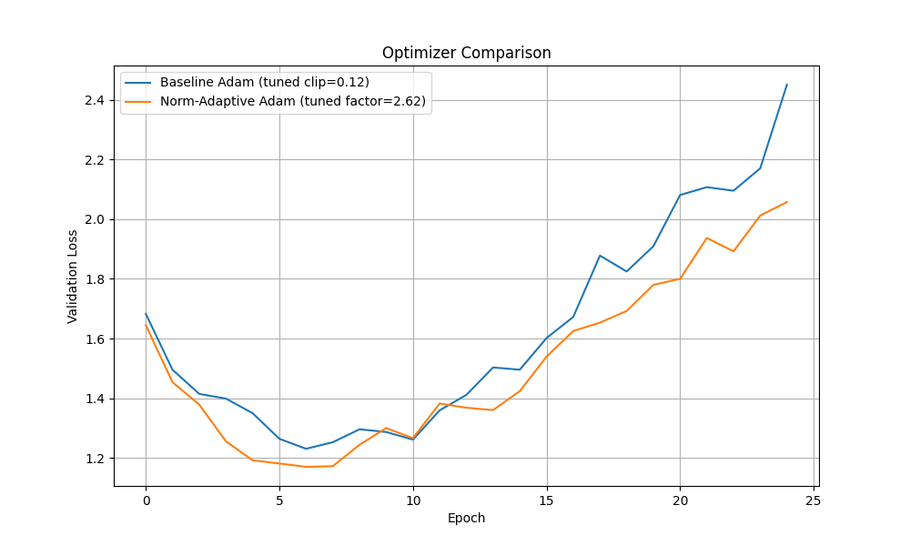

# Weight-Norm-Adaptive Gradient Clipping Experiment

This experiment investigates a novel gradient clipping strategy called "Weight-Norm-Adaptive Gradient Clipping".

## Hypothesis

The hypothesis is that dynamically adjusting the gradient clipping threshold for each layer based on the Frobenius norm of its weight matrix can be more effective than using a fixed, global clipping threshold. The intuition is that layers with larger weights should be allowed to receive larger gradient updates, and this adaptive approach could lead to faster convergence and better generalization.

## Method

To test this hypothesis, a new PyTorch optimizer, `NormAdaptiveAdam`, was implemented. This optimizer wraps a standard Adam optimizer and, before each step, clips the gradients of each parameter individually. The clipping threshold for each parameter is calculated as:

`clip_threshold = clip_factor * ||W||_F`

where `||W||_F` is the Frobenius norm of the weight tensor `W`, and `clip_factor` is a tunable hyperparameter.

This new optimizer was compared against a baseline Adam optimizer that uses a standard, fixed gradient clipping threshold. To ensure a fair comparison, the learning rate for both optimizers, the `clip_factor` for the new optimizer, and the `clip_value` for the baseline were all tuned using Optuna over 30 trials. The `mnist1d` dataset was used for training and evaluation. A critical bug in the initial baseline implementation was found during code review and has been corrected to ensure a valid comparison.

## Results

After tuning with the corrected baseline, the best hyperparameters were used to train both models for 25 epochs. The validation loss curves are shown below:

The corrected results show that both optimizers achieve similar performance in the early stages of training. Both methods manage to find a good solution quickly, but then begin to overfit as training progresses, with the validation loss increasing in later epochs.

## Conclusion

After a fair and corrected comparison, the experiment did not show a significant advantage for the proposed Weight-Norm-Adaptive Gradient Clipping method over a standard Adam optimizer with a well-tuned fixed clipping threshold. Both methods performed comparably on this task. The adaptive clipping strategy did not appear to offer better protection against overfitting in this context. It is possible that on different model architectures or datasets, the adaptive nature of this clipping strategy might prove more beneficial.
