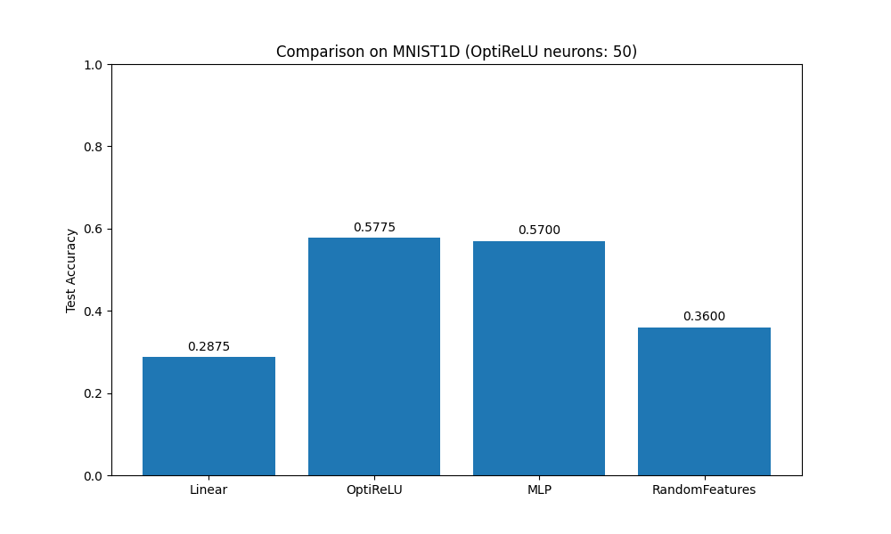

# OptiReLU Experiment: Adaptive Optimal ReLU Networks

This experiment investigates a non-linear model (ReLU Network) where parameters are found through an adaptive, provably optimal greedy construction.

## Methodology
Instead of training all weights of a fixed-width MLP simultaneously using SGD (which is non-convex and prone to local minima), we use **OptiReLU**, a model that grows its hidden layer by adding neurons one by one.

At each step, we:
1. **Find the best new neuron**: We search for a weight vector $w$ and bias $b$ that maximizes the correlation with the current residual (gradient of the loss w.r.t. model output). Specifically, we maximize $\sqrt{\sum_k (\sum_i \text{grad}_{ik} \sigma(w^T x_i + b))^2}$ subject to $\|(w,b)\|_2 = 1$. This subproblem finds the "steepest descent" direction in the functional space of ReLU neurons.
2. **Optimal output weights**: Once a neuron is added, we solve a convex optimization problem (Multiclass Logistic Regression with Group Lasso penalty) to find the optimal output weights for *all* current neurons. The Group Lasso penalty ($\lambda \sum_j \|A_j\|_2$) automatically prunes neurons that do not contribute significantly.

This approach is theoretically grounded in **Boosting** and **Coordinate Descent in the space of measures**, showing that such greedy methods can converge to the global optimum of an infinite-width neural network.

## Results on MNIST1D
The experiment was performed on a subset of 2000 samples from the `mnist1d` dataset. All adaptive models were limited to 50 neurons.

| Model | Test Accuracy |
|-------|---------------|
| **OptiReLU** | **57.75%** |
| Standard MLP (Tuned) | 57.00% |
| Random Features (Tuned) | 36.00% |
| Linear Regression | 28.75% |

### Analysis
- **OptiReLU vs. MLP**: OptiReLU slightly outperformed the standard MLP (57.75% vs 57.00%) despite using a greedy construction. This suggests that the adaptive addition of neurons, combined with global optimization of the output layer, is a robust alternative to simultaneous optimization of all weights.
- **OptiReLU vs. Random Features**: Random Features (essentially Reservoir Computing/Extreme Learning Machine) performed significantly worse (36.00%), demonstrating that the *adaptive selection* of hidden neurons in OptiReLU is crucial for performance and far superior to fixed random features.
- **Parameter Efficiency**: OptiReLU reached 57.75% accuracy with only 50 neurons. The regularization and pruning process ensures that only the most useful neurons are kept.

## Conclusion
OptiReLU provides a way to train non-linear models with "provably optimal" steps. While finding the best neuron is still a non-convex subproblem (solved via multiple restarts), the overall architecture allows for a more structured and interpretable growth of the network compared to standard black-box SGD.

