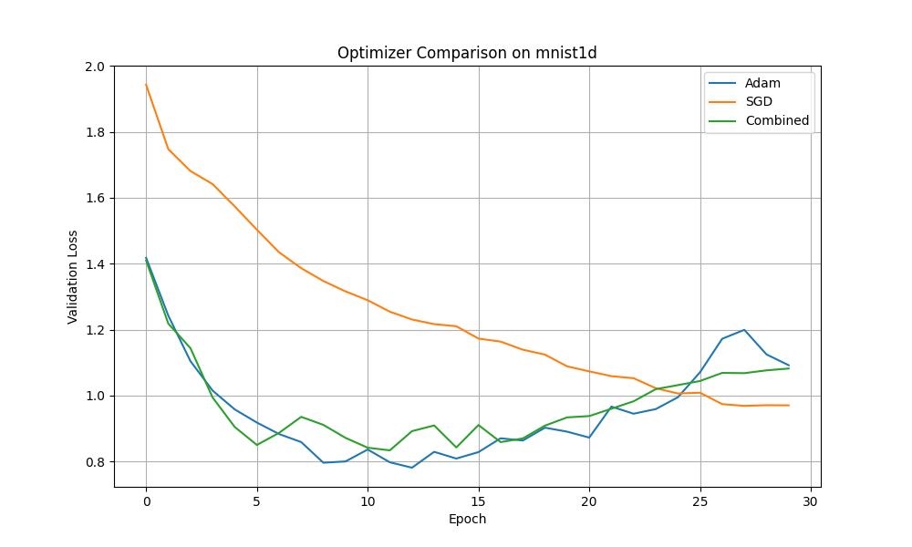

# Experiment: Convex Combination of Optimizers

This experiment investigates whether a dynamic, convex combination of two different optimizers can lead to better performance than either optimizer on its own.

## Hypothesis

By combining a more explorative optimizer (like Adam) in the early stages of training with a fine-tuning optimizer (like SGD) in the later stages, we might achieve faster initial convergence and a better final solution. The combination is controlled by a mixing parameter `alpha` which is a function of the training step.

The combined update is defined as:
`update = (1 - alpha) * update_optimizer1 + alpha * update_optimizer2`

In this experiment, we use Adam as `optimizer1` and SGD as `optimizer2`, with a linear schedule for `alpha` that transitions from 0 to 1 over the course of training. This means the optimizer starts as pure Adam and gradually becomes pure SGD.

## Methodology

1.  **Optimizer Implementation**: A `CombinedOptimizer` was created in `optimizer.py`. This optimizer wraps two base optimizers and applies a weighted average of their updates at each step, based on a provided `alpha` schedule.
2.  **Dataset**: The `mnist1d` dataset was used for its fast training and evaluation characteristics.
3.  **Model**: A simple Multi-Layer Perceptron (MLP) with two hidden layers was used as the base model.
4.  **Fair Comparison**: To ensure a fair comparison, the learning rates for Adam, SGD, and both base optimizers within the `CombinedOptimizer` were tuned using Optuna over 20 trials. The best hyperparameters from this search were then used for a final training run of 30 epochs.
5.  **Benchmarking**: The `CombinedOptimizer` (Adam -> SGD) was benchmarked against standalone Adam and SGD optimizers.

## Results

The validation loss curves for the three optimizers are shown below:

The results indicate that both Adam and the CombinedOptimizer significantly outperform SGD in terms of convergence speed and final validation loss. The `CombinedOptimizer` performs very similarly to the tuned Adam optimizer. It achieves a slightly lower validation loss early on but ends up at a similar performance level to Adam by the end of training.

## Conclusion

The hypothesis that a simple linear combination of Adam and SGD would outperform a well-tuned Adam optimizer is not strongly supported by these results. While the combined approach is effective, it does not offer a significant advantage over a standard tuned Adam optimizer on this task. The overhead of tuning two separate learning rates for the combined optimizer also makes it less practical than simply using Adam.
