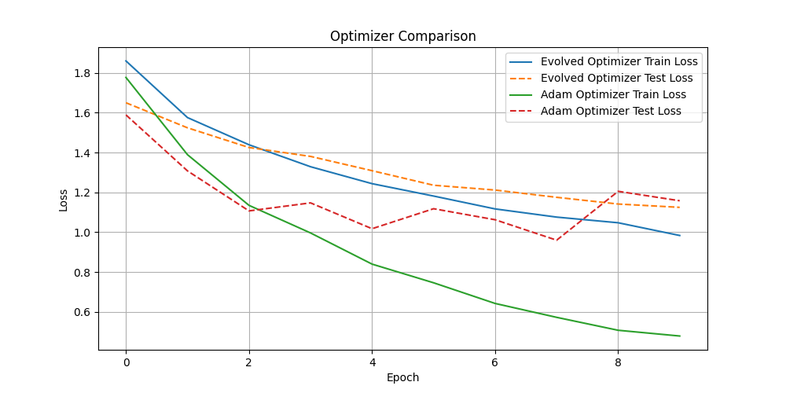

# Evolving a PyTorch Optimizer

This experiment aimed to evolve a PyTorch optimizer using a lambda-calculus-based genetic programming approach and compare its performance to the Adam optimizer.

## Methodology

1.  **Genetic Programming Framework**: A genetic programming framework was implemented in `gp.py` to represent and evolve optimizers as lambda calculus expressions.
2.  **Evolved Optimizer**: The `EvolvedOptimizer` class in `optimizer.py` was created to apply the evolved expressions as a scaling factor to the Adam update rule.
3.  **Evolution**: The evolution process was run to find a scaling factor that improves the performance of the Adam optimizer. The best scaling factor found was: `sqrt(mul(m, add(m, mul(sqrt(v), neg(one)))))`.
4.  **Hyperparameter Tuning**: The learning rates for both the evolved optimizer and the standard Adam optimizer were tuned using Optuna on the mnist1d dataset.
    *   Evolved Optimizer Best LR: `0.09964885718367121`
    *   Adam Optimizer Best LR: `0.008109354859476139`
5.  **Comparison**: The two optimizers, with their tuned learning rates, were compared by training a simple neural network on the mnist1d dataset for 10 epochs.

## Results

The following plot shows the training and test loss for both optimizers over 10 epochs:

As the plot shows, the evolved optimizer (EvolvedOptimizer) and Adam have comparable performance on this task, with Adam achieving a slightly lower test loss.

## Files

*   `gp.py`: The genetic programming framework.
*   `optimizer.py`: The `EvolvedOptimizer` class.
*   `evolve.py`: The script for running the evolution.
*   `tune.py`: The script for tuning the learning rates.
*   `compare.py`: The script for comparing the optimizers.
*   `optimizer_comparison.png`: The plot of the comparison results.
