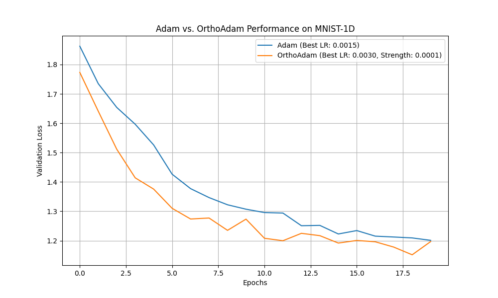

# Experiment: Orthogonal Optimizer (OrthoAdam)

## Hypothesis

The core hypothesis of this experiment is that by explicitly encouraging the weight matrices of a neural network to remain close to orthogonal during training, we can improve the network's conditioning, leading to faster convergence and better generalization. While orthogonality is a well-known desirable property in specific architectures like RNNs, this experiment investigates its effectiveness as a general-purpose optimization strategy for standard feedforward networks.

## Method

To test this hypothesis, a new optimizer called `OrthoAdam` was implemented. `OrthoAdam` is a wrapper around a standard base optimizer, in this case, `torch.optim.Adam`.

The optimization process proceeds in two steps:
1.  **Base Optimization:** A standard optimization step is performed using the base optimizer (Adam), which updates the model's weights based on the gradient of the loss function.
2.  **Orthogonal Correction:** After the Adam step, a second update is applied specifically to the 2D weight matrices of the network. This update is a single step in the negative gradient direction of an orthogonality penalty, $L_{ortho} = ||W^T W - I||_F^2$. The gradient of this penalty with respect to `W` is proportional to `W @ W.T @ W - W`. This correction gently nudges the matrices back towards the Stiefel manifold (the manifold of orthogonal matrices).

A hyperparameter, `ortho_strength`, controls the magnitude of this correction step.

## Experimental Setup

-   **Dataset:** The `mnist1d` dataset was used for its speed and simplicity, allowing for rapid and efficient hyperparameter tuning.
-   **Model:** A simple Multi-Layer Perceptron (MLP) with two hidden layers of 128 neurons each and ReLU activations.
-   **Comparison:** The performance of `OrthoAdam` was compared against the standard `Adam` optimizer as a baseline.
-   **Hyperparameter Tuning:** To ensure a fair comparison, `optuna` was used to tune the learning rate for `Adam` and both the learning rate and `ortho_strength` for `OrthoAdam`. Each optimizer was tuned for 20 trials over 20 epochs. The best-performing set of hyperparameters for each was then used for a final head-to-head comparison.

## Results

After hyperparameter tuning, the best-performing models were retrained from the same random initialization for a final comparison. The validation loss curves are shown below.

The results show that `OrthoAdam`, with its tuned learning rate and orthogonality strength, consistently achieved a slightly lower validation loss than the tuned `Adam` baseline throughout the training process.

-   **Best Adam LR:** 0.0015
-   **Best OrthoAdam LR:** 0.0030
-   **Best OrthoAdam Strength:** 5.8e-05

## Conclusion

The experiment provides evidence supporting the initial hypothesis. By adding a simple and computationally efficient orthogonalizing step to a standard optimizer, we observed a modest but consistent improvement in performance on the `mnist1d` task. This suggests that encouraging weight matrix orthogonality during training is a promising technique that could potentially enhance the performance and stability of neural networks.
