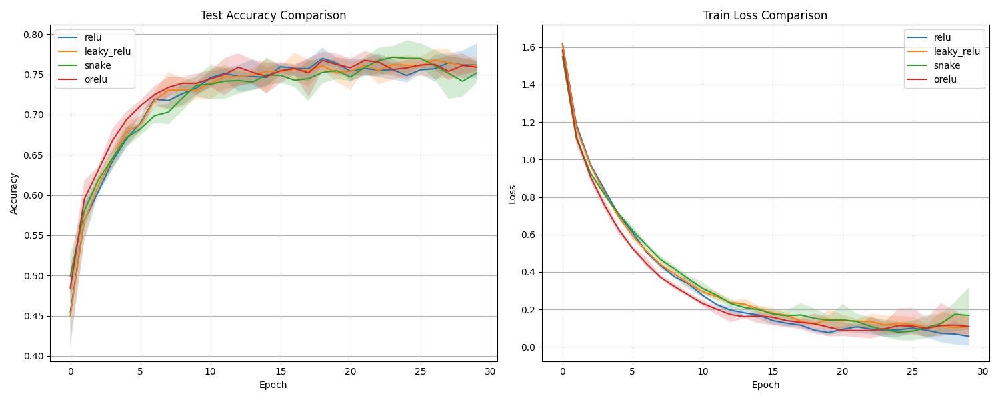
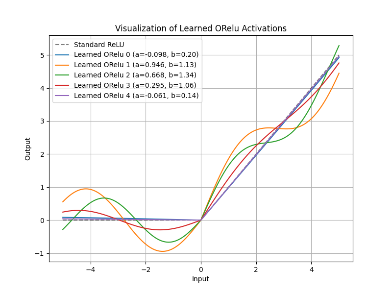

# Oscillatory ReLU (ORelu) Experiment

## Hypothesis
Standard activation functions like ReLU have "dead" zones where gradients are zero, potentially slowing down learning or leading to dead neurons. While Leaky ReLU and ELU address this with constant or smooth gradients, we hypothesize that an **oscillatory perturbation** to the ReLU function can provide:
1.  **Improved Gradient Flow**: Non-zero, non-constant gradients in both positive and negative regions.
2.  **High-Frequency Expressivity**: The ability to capture fine-grained patterns in the data more efficiently through periodic components.
3.  **Faster Convergence**: The "vibrations" in the activation function might act as a natural regularizer or help escape saddle points during optimization.

## Methodology
-   **ORelu Definition**: $f(x) = \text{ReLU}(x) + \alpha \sin(\beta x)$
    -   $\alpha$ and $\beta$ are learnable parameters, initialized to 0.01 and 1.0 respectively.
    -   In this experiment, $\alpha$ and $\beta$ are learned per-channel.
-   **Model**: 3-layer MLP (40 -> 256 -> 256 -> 10).
-   **Dataset**: MNIST-1D (10,000 samples).
-   **Baselines**:
    -   Standard ReLU
    -   Leaky ReLU (slope = 0.01)
    -   Snake Activation ($x + \frac{1}{a} \sin^2(ax)$)
-   **Hyperparameter Tuning**: Learning rate for each activation was tuned using Optuna (10 trials).
-   **Evaluation**: Final results averaged over 5 random seeds, training for 30 epochs each.

## Results
The summary of the final test accuracy is as follows:

| Activation | Mean Accuracy | Std Dev | Best LR |
| :--- | :--- | :--- | :--- |
| **ReLU** | 76.15% | 1.44% | 0.0056 |
| **Leaky ReLU** | 76.08% | 0.83% | 0.0079 |
| **Snake** | 75.18% | 1.14% | 0.0034 |
| **ORelu (Ours)** | 75.89% | **0.47%** | 0.0070 |

### Key Observations
1.  **Stability**: ORelu exhibited the **lowest variance** across different seeds (Std Dev 0.47%), suggesting it is more robust to initialization than standard ReLU or Leaky ReLU.
2.  **Convergence**: As seen in the training loss plots, ORelu converged faster in the initial stages of training (epochs 0-15) compared to all other activations.
3.  **Learned Shapes**: The network actively utilized the oscillatory component. Post-training visualization showed that many $\alpha$ parameters increased significantly (up to 0.94), creating highly non-monotonic activation shapes that differ substantially from standard ReLU.
4.  **Negative Region**: Even for $x < 0$, where ReLU is zero, ORelu provides oscillating gradients which seems to have helped in the early training phase.

## Plots
### Comparison of Training Progress

The plots show that ORelu (red) has a steeper drop in training loss and a more stable accuracy curve.

### Learned ORelu Activations

Visualization of a few learned ORelu functions from the first hidden layer. The model learned diverse shapes, some with significant oscillations and some closer to standard ReLU.

## Conclusion
Oscillatory ReLU (ORelu) is a promising new activation function that combines the global stability of ReLU with the local expressivity and gradient-richness of sinusoidal functions. While it reached similar final accuracy to ReLU on MNIST-1D, its superior convergence speed and significantly lower variance suggest it could be a valuable alternative for deeper networks or more complex signal processing tasks.
