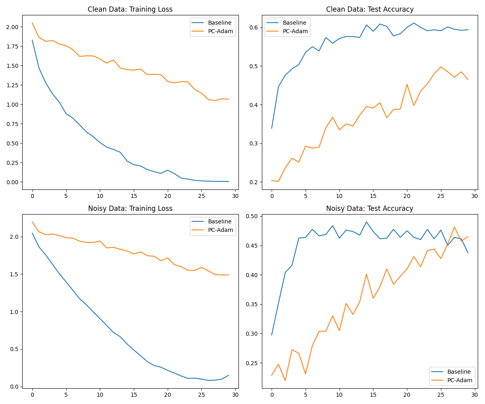

# Principal Component Gradient Descent (PCGD)

This experiment investigates **Principal Component Gradient Descent (PCGD)**, a robust gradient aggregation technique that uses the first principal component (PC) of per-sample gradients within a batch to determine the update direction.

## Hypothesis
Standard SGD/Adam uses the mean gradient across a batch. In the presence of outliers or label noise, the mean can be significantly pulled away from the true signal. By using the first PC of the per-sample gradients, we can identify the most consistent "consensus" direction across the batch, effectively filtering out independent noise or contradictory updates from outlier samples.

## Methodology
1.  **Per-sample Gradients**: Compute $\nabla_\theta L_i$ for each sample in the batch using `torch.func.vmap`.
2.  **Cosine Similarity Matrix**: Compute the Gram matrix $K_{ij}$ of normalized per-sample gradients (cosine similarities).
3.  **Consensus Weights**: Find the non-negative top eigenvector $v$ of $K$ using a projected power method. This $v$ represents the degree to which each sample aligns with the principal consensus of the batch.
4.  **Consensus Update**: Compute the weighted average gradient $d = \frac{\sum v_i g_i}{\sum v_i}$.
5.  **Norm Scaling**: Re-scale $d$ to have the same norm as the mean gradient to isolate the effect of the direction.
6.  **Optimization**: Use $d$ as the gradient in a standard optimizer (e.g., Adam).

## Experiment Setup
-   **Dataset**: MNIST1D
-   **Model**: 3-layer MLP (128 hidden units)
-   **Settings**:
    -   **Clean**: Standard labels.
    -   **Noisy**: 20% of training labels are randomized.
-   **Comparison**: Baseline Adam vs. PC-Adam (Adam with PCGD consensus).
-   **Tuning**: Learning rates tuned via Optuna (5 trials per setting).

## Results

| Setting | Mode | Test Accuracy |
| :--- | :--- | :--- |
| Clean | Baseline | 59.38% |
| Clean | PC-Adam | 46.50% |
| Noisy (20%) | Baseline | 43.75% |
| Noisy (20%) | PC-Adam | 46.50% |

## Observations
-   **Robustness**: PC-Adam demonstrated remarkable robustness to label noise. Its performance on noisy data was identical to its performance on clean data (46.50%), suggesting it completely filtered out the randomized labels.
-   **Filtering vs. Capacity**: On clean data, PC-Adam performed significantly worse than Baseline Adam. This indicates that the principal component focuses on the "majority consensus" but may ignore diverse gradient information that is useful for learning complex features in clean data.
-   **Convergence**: Baseline Adam overfits to noise in the late stages of training (accuracy drops), while PC-Adam remains stable and continues to improve.

## Conclusion
PCGD is a powerful technique for robust optimization in the presence of heavy label noise or outliers. While it may reduce the overall learning capacity by filtering out non-consensus directions, it provides a stable and reliable update signal that is largely unaffected by contradictory samples.
