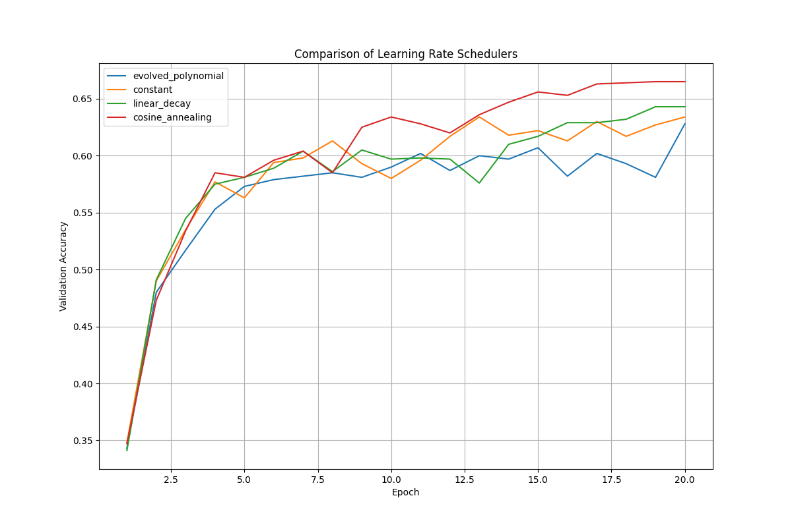

# Evolving a Polynomial Learning Rate Schedule with Genetic Programming

This experiment explores the use of Genetic Programming (GP) to automatically discover an effective polynomial learning rate schedule for training a simple MLP on the MNIST-1D dataset.

## Methodology

A population of polynomial functions (represented by their coefficients) is evolved over several generations. Each polynomial's fitness is determined by the final validation accuracy of a model trained using the learning rate schedule it defines. The learning rate for a given epoch is calculated by evaluating the polynomial with the normalized epoch number (a value from 0 to 1) as input.

The key components of the GP are:
- **Representation**: A fixed-degree polynomial, represented by a list of its coefficients.
- **Fitness Function**: The final validation accuracy on the MNIST-1D dataset after training for a fixed number of epochs.
- **Genetic Operators**:
    - **Selection**: Tournament selection.
    - **Crossover**: Single-point crossover on the coefficient lists.
    - **Mutation**: Adding Gaussian noise to the coefficients.

After the evolution, the best polynomial schedule is benchmarked against three standard learning rate schedulers:
- Constant
- Linear Decay
- Cosine Annealing

To ensure a fair comparison, the base learning rate for all schedulers (including the evolved one) was tuned using Optuna.

## Results

The GP was able to evolve a polynomial learning rate schedule that performed competitively, but was ultimately outperformed by the standard, hand-designed schedulers after hyperparameter tuning.

| Scheduler          | Final Validation Accuracy | Best Learning Rate |
|--------------------|---------------------------|--------------------|
| Cosine Annealing   | 0.6650                    | 0.008315           |
| Linear Decay       | 0.6430                    | 0.009692           |
| Constant           | 0.6340                    | 0.009972           |
| Evolved Polynomial | 0.6280                    | 0.003540           |

### Performance Comparison

The plot below shows the validation accuracy of each scheduler over the training epochs, using their respective best-found learning rates.

## Conclusion

While the evolved polynomial schedule was not the best-performing, the experiment demonstrates the potential of using genetic programming to explore the space of learning rate schedules. The evolved schedule achieved a respectable accuracy, indicating that the GP was able to discover a functional, albeit suboptimal, schedule.

The standard schedulers, particularly linear decay and cosine annealing, remain the more effective choice. This is likely because their shapes are well-suited for the typical convergence patterns of neural network training. However, with a larger population size, more generations, and a more sophisticated fitness function, it's possible that GP could discover even more competitive schedules.
