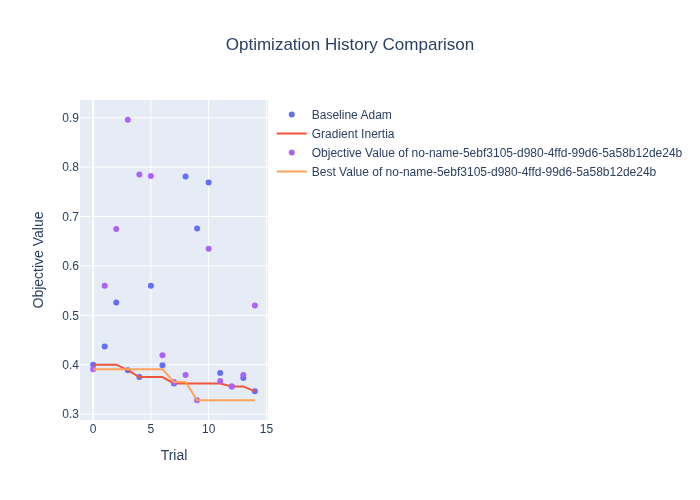

# Experiment: Gradient Inertia Regularization

**Note:** This experiment was conducted in a directory named `polynomial_regularization_experiment` due to a change in research direction after the initial setup. The experiment performed was **Gradient Inertia**, not Polynomial Regularization.

## Hypothesis

Penalizing sharp changes in the gradient's direction relative to its historical momentum (the first moment estimate in Adam) can lead to more stable training and improved generalization. The hypothesis is that forcing the gradient updates to be more consistent with their recent trajectory will prevent erratic steps and allow the optimizer to settle into a better minimum.

The regularization term is defined as: `λ * ||g_t - m_{t-1}||^2`, where:
- `g_t` is the gradient at the current step.
- `m_{t-1}` is the exponential moving average of the gradient (momentum) from the previous step.
- `λ` is the regularization strength, a hyperparameter to be tuned.

## Methodology

1.  **Dataset**: The `mnist1d` dataset was used for rapid experimentation.
2.  **Model**: A simple Multi-Layer Perceptron (MLP) with two hidden layers and ReLU activation functions was used.
3.  **Baseline**: A standard Adam optimizer was used as the baseline for comparison.
4.  **Proposed Method (Gradient Inertia)**: The Adam optimizer was modified to incorporate the gradient inertia regularization term into the loss function. This required calculating the gradients with `create_graph=True` to allow for backpropagation through the gradients themselves.
5.  **Hyperparameter Tuning**: `Optuna` was used to perform a fair comparison. It tuned the learning rate for the baseline Adam optimizer and tuned both the learning rate and the regularization strength (`λ`) for the Gradient Inertia method. Each study was run for 15 trials.
6.  **Evaluation**: The primary metric for comparison was the minimum validation loss (1 - accuracy) achieved across the training epochs.

## Results

The experiment was run, and the results were compared after tuning the hyperparameters for both methods.

-   **Baseline (Adam)**:
    -   Best Validation Loss (1 - Accuracy): `0.3460`
    -   Best Parameters: `{'lr': 0.0115}`
-   **Gradient Inertia**:
    -   Best Validation Loss (1 - Accuracy): `0.3280`
    -   Best Parameters: `{'lr': 0.0066, 'reg_lambda': 0.00057}`

The optimization history comparison plot generated by Optuna is shown below:

## Conclusion

The results suggest that the **Gradient Inertia** regularization method provides a slight improvement in performance over the standard Adam optimizer on the `mnist1d` dataset. The final validation loss for the proposed method was lower than that of the baseline after a fair hyperparameter search.

While the improvement is modest, the hypothesis is supported. Penalizing deviations from the gradient's momentum appears to be a promising direction for regularization, warranting further investigation on more complex datasets and models. The added computational cost is non-trivial due to the need to create a graph from the gradients, which may be a factor in larger-scale applications.