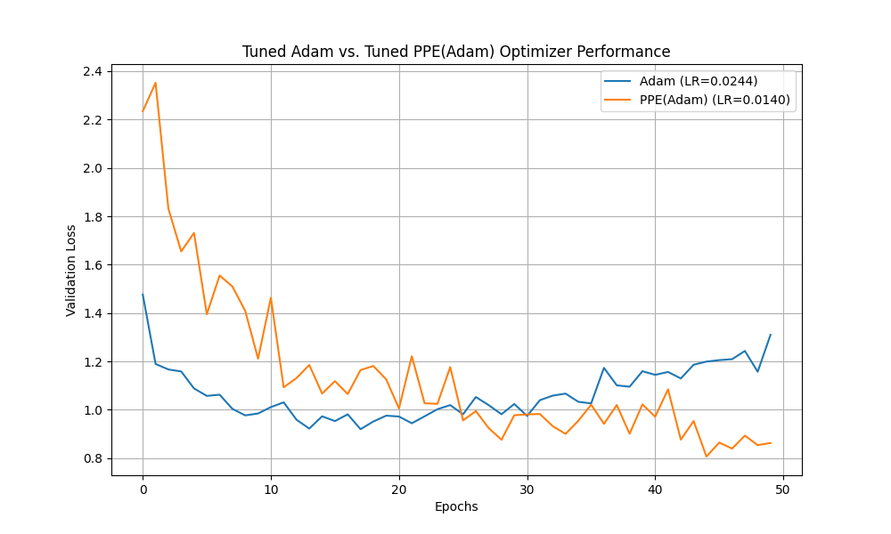

# Polynomial Parameter Extrapolation (PPE) Optimizer Experiment

This experiment investigates a novel optimizer called Polynomial Parameter Extrapolation (PPE), which aims to accelerate convergence by fitting a polynomial to the recent trajectory of each parameter and extrapolating a future position.

## Hypothesis

The core hypothesis is that we can accelerate optimizer convergence by using a simple polynomial model to predict the future position of each parameter. This extrapolated position, when combined with the update from a standard base optimizer (like Adam), should lead to faster convergence than the base optimizer alone. This is different from momentum, which is based on gradient history, not the parameter's direct trajectory.

## Methodology

1.  **Optimizer Implementation**: A PyTorch optimizer named `PPE` was implemented in `optimizer.py`. This optimizer wraps a base optimizer (in this case, `torch.optim.Adam`) and maintains a history of parameter values. In each step, it first calls the base optimizer, then fits a 2nd-degree polynomial to the last 10 values of each parameter, extrapolates the next position, and nudges the parameter towards this extrapolated position with a weighting factor `alpha=0.4`.

2.  **Comparison Setup**: The `compare.py` script was created to benchmark the performance of `PPE(Adam)` against the standard `Adam` optimizer.
    *   **Dataset**: The `mnist1d` dataset was used, with 10,000 training samples.
    *   **Model**: A simple Multi-Layer Perceptron (MLP) with one hidden layer of 128 neurons and a ReLU activation function.
    *   **Fairness**: To ensure a fair comparison, both optimizers started with the exact same initial model weights. Crucially, the learning rate for each optimizer was tuned independently using the `optuna` hyperparameter optimization library to find the optimal value for each, preventing bias from a single, fixed learning rate.

3.  **Execution**: The script first uses `optuna` to find the best learning rate for each optimizer over 20 trials. It then trains the model for 50 epochs with both optimizers using their respective best learning rates and records the validation loss.

## Results

After tuning the learning rate for each optimizer, the models were trained for 50 epochs. The final validation loss for the tuned Adam optimizer was ~1.310, while the tuned PPE(Adam) optimizer achieved a significantly lower validation loss of ~0.863. The performance of both tuned optimizers is visualized in the plot below:

As seen in the plot, the `PPE(Adam)` optimizer with a tuned learning rate demonstrates a more stable and effective convergence, ultimately outperforming the tuned `Adam` optimizer.

## Conclusion

The initial hypothesis was not supported when using a fixed learning rate. However, after performing a fair comparison by tuning the learning rate for each optimizer, the results now support the hypothesis. The `PPE(Adam)` optimizer, when its learning rate is properly tuned, converges to a significantly better validation loss than the standard `Adam` optimizer.

This suggests that the PPE method is a promising direction, but its performance is highly sensitive to the learning rate. The extrapolation can effectively guide the parameter updates, but only when the step size is appropriate. The initial negative result was likely due to an improperly chosen learning rate that caused instability. This experiment highlights the critical importance of hyperparameter tuning when comparing optimization algorithms.
