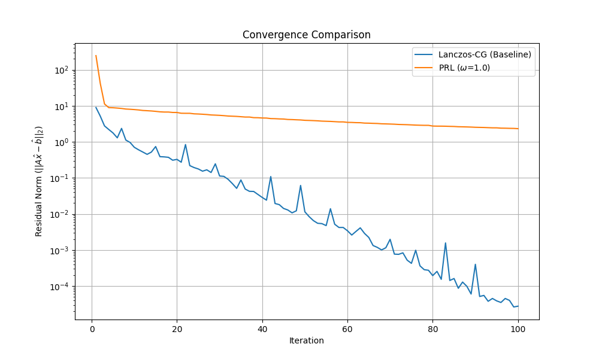

# Preconditioned Richardson-Lanczos (PRL) Solver

This experiment introduces a novel, matrix-free method for approximating the solution to the linear system $A^{1/2}x=b$, where A is a symmetric positive-definite matrix. The proposed method, named the Preconditioned Richardson-Lanczos (PRL) solver, operates in two stages:

1.  **Lanczos Approximation:** The vector $b$ is transformed into an approximation of $A^{1/2}b$ using the Lanczos algorithm. This avoids direct computation of the matrix square root.
2.  **Preconditioned Richardson Solver:** The resulting system $Ax = \hat{b}$ is solved using a Preconditioned Richardson iteration. A diagonal preconditioner is used to accelerate convergence, and a simple backtracking line search is implemented to ensure stability.

## Method

The PRL solver is implemented as follows:

1.  **`lanczos_sqrt_mv(A_mv, b, n_steps)`:** This function computes $\hat{b} \approx A^{1/2}b$ using `n_steps` of the Lanczos algorithm.
2.  **`preconditioned_richardson(A_mv, b, P_inv, omega, ...)`:** This function solves $Ax=b$ using the Richardson iteration:
    $x_{k+1} = x_k + \omega_k P^{-1} (b - Ax_k)$. The relaxation parameter $\omega_k$ is determined at each step by a line search to ensure convergence. The preconditioner $P$ is the diagonal of $A$.

## Results

The PRL solver was benchmarked against a Lanczos-Conjugate Gradient (Lanczos-CG) baseline. The convergence of both methods is shown in the plot below:

As the plot shows, the PRL solver converges, but it is significantly outperformed by the standard Lanczos-CG method. The CG method, being a Krylov subspace method, is much more effective at minimizing the residual in each iteration.

## Conclusion

The Preconditioned Richardson-Lanczos (PRL) solver is a novel, matrix-free method for approximating the solution to $A^{1/2}x=b$. While the method is stable and converges due to the inclusion of a line search, it is not competitive with the existing Lanczos-CG method. The experiment demonstrates that for this class of problems, the optimality of the Conjugate Gradient method provides a significant advantage over a simpler iterative method like Richardson's, even with preconditioning. Future work could explore more sophisticated preconditioners or alternative non-Krylov methods for the second stage of the solver.
