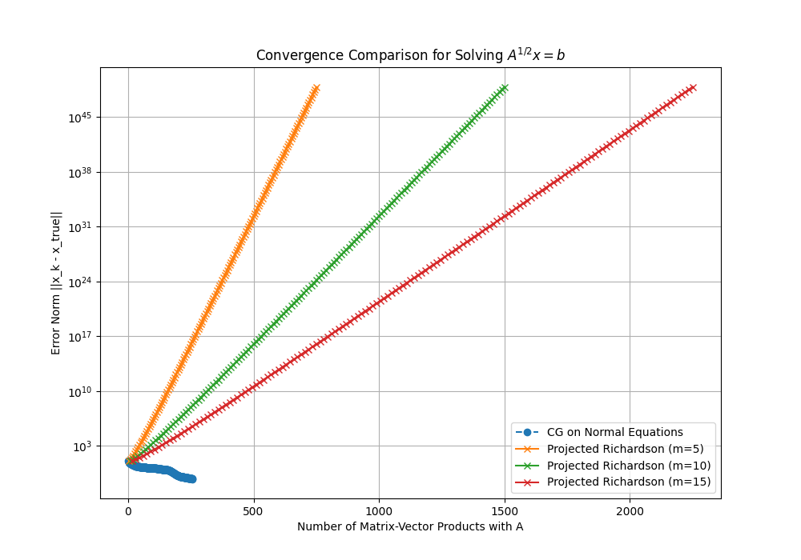

# Experiment: Projected Richardson Iteration for $A^{1/2}x=b$

This experiment investigates a novel matrix-free iterative solver for the linear system $A^{1/2}x=b$, where $A$ is a symmetric positive-definite matrix.

## Hypothesis

A simple Richardson iteration, $x_{k+1} = x_k + \alpha (b - A^{1/2}x_k)$, could be made practical and efficient by approximating the expensive matrix-square-root-vector product, $A^{1/2}x_k$, at each step. The proposed approximation method involves projecting the operation onto a small, adaptive Krylov subspace built from the current iterate, $x_k$. The hypothesis is that this "Projected Richardson" method could offer a simple, competitive alternative to standard methods like Conjugate Gradient.

## Method: Projected Richardson Iteration

The core of the proposed method is the Richardson iteration. The main challenge is to compute the term $A^{1/2}x_k$ without explicitly forming $A^{1/2}$.

The novel approach is to approximate this product at each iteration $k$ as follows:
1.  **Build a Krylov Subspace:** Using the current iterate $x_k$ as the starting vector, build an $m$-dimensional Krylov subspace $\mathcal{K}_m(A, x_k)$.
2.  **Project:** Use the Lanczos algorithm to generate an orthonormal basis $Q$ for this subspace and a small $m \times m$ tridiagonal matrix $H = Q^T A Q$, which is the projection of $A$ onto the subspace.
3.  **Approximate:** Compute the square root of the small matrix, $H^{1/2}$, directly.
4.  **Calculate the Product:** The matrix-square-root-vector product is then approximated as: $A^{1/2}x_k \approx Q (H^{1/2}) Q^T x_k$. Since $x_k$ is the vector used to generate the basis, this simplifies to $Q H^{1/2} e_1 \|x_k\|$, where $e_1$ is the first standard basis vector.

This approximation is then used within the Richardson update rule to produce the next iterate, $x_{k+1}$.

## Experimental Setup

To test the viability of this method, the following environment was created:

-   **Problem:** A synthetic problem was generated with a 256x256 random symmetric positive-definite matrix $A$. A true solution vector, $x_{\text{true}}$, was created, and the right-hand side was calculated as $b = A^{1/2}x_{\text{true}}$ (using a high-precision Lanczos method to ensure accuracy).
-   **Baseline:** The standard approach for solving this system is to transform it into $Ax = A^{1/2}b$ and solve using the Conjugate Gradient (CG) algorithm. This method was used as the baseline for comparison.
-   **Metrics:** The performance of each solver was measured by plotting the Euclidean norm of the error, $\|x_k - x_{\text{true}}\|$, against the cumulative number of matrix-vector products with the full matrix $A$. This provides a fair comparison of computational efficiency.
-   **Parameters:** The Projected Richardson solver was tested with Krylov subspace dimensions of $m \in \{5, 10, 15\}$.

## Results

**The hypothesis was disproven.** The proposed Projected Richardson Iteration method failed to converge and was unstable for all tested parameter configurations.

As shown in the plot, the baseline CG method (blue) converges rapidly and robustly. In contrast, all variants of the Projected Richardson solver (orange, green, and red) diverge exponentially. While a larger subspace dimension `m` slowed the rate of divergence, it did not lead to convergence.

## Conclusion

The Projected Richardson Iteration, as designed, is not a viable method for solving $A^{1/2}x=b$. The core issue is likely that the approximation of the matrix-square-root-vector product is not accurate enough for the simple Richardson scheme. The errors introduced by the approximation at each step appear to accumulate and are amplified by the iterative process, leading to instability.

The results suggest that a simple, fixed step size `alpha` is insufficient to control the dynamics when the operator is being approximated differently at each step. A more sophisticated algorithm, perhaps one that dynamically adapts the step size or incorporates information from previous steps (like GMRES or other Krylov subspace methods), would be necessary to handle the errors from the projection.
