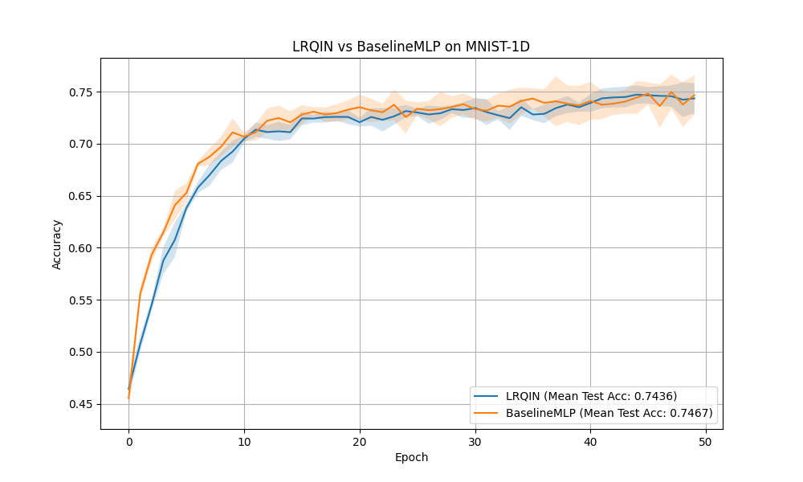

# Low-Rank Quadratic Interaction Network (LRQIN) Experiment

## Hypothesis
Standard Multi-Layer Perceptrons (MLPs) rely on linear transformations followed by element-wise activations, which may require many layers to capture complex feature interactions. We hypothesize that incorporating a **rank-1 quadratic interaction term** directly into each layer—defined as $y = Wx + b + (Ux) \odot (Vx)$—will allow the network to model multiplicative interactions more efficiently. This "Low-Rank Quadratic Interaction Network" (LRQIN) should provide a stronger inductive bias for tasks where feature products are discriminative, potentially outperforming a standard MLP of similar parameter count.

## Methodology
- **QuadraticLayer**: Implements $y = Wx + b + (Ux) \odot (Vx)$, where $W, U, V$ are learnable weight matrices.
- **LRQIN**: A 2-hidden-layer network (hidden dim 68) using `QuadraticLayer`.
- **BaselineMLP**: A standard 2-hidden-layer MLP (hidden dim 128) with a comparable parameter budget (~23k parameters).
- **Dataset**: `mnist1d` (10,000 samples).
- **Tuning**: Learning rates for both models were tuned using Optuna (10 trials each).
- **Evaluation**: Both models were evaluated across 5 random seeds for 50 epochs using their respective best learning rates.

## Results

| Model | Parameters | Best LR | Test Accuracy (Mean +/- Std) |
| :--- | :--- | :--- | :--- |
| **LRQIN** | 22,858 | 0.00185 | 74.36% +/- 1.45% |
| **BaselineMLP** | 23,050 | 0.00455 | **74.67% +/- 1.89%** |

### Analysis
- **Performance**: The LRQIN achieved a mean test accuracy of 74.36%, which is very close to the Baseline MLP's 74.67%. In this specific configuration on `mnist1d`, the explicit quadratic interaction did not provide a significant advantage over a wider standard MLP with a similar parameter count.
- **Stability**: LRQIN showed slightly lower variance (std 1.45% vs 1.89%) compared to the Baseline MLP, suggesting that the quadratic inductive bias might lead to more stable convergence in some cases, although the effect is small.
- **Complexity vs. expressive power**: While the quadratic term $ (Ux) \odot (Vx) $ allows for modeling interactions, the same parameter budget allowed the standard MLP to have nearly double the hidden dimension (128 vs 68). The added width in the MLP seems to compensate for the lack of explicit higher-order interactions for this particular dataset.

## Visualizations
The training and test accuracy curves averaged over 5 seeds are shown below:

## Verification
The implementation was verified through:
1. `test_logic.py`: Confirmed correct shapes, gradient flow to all parameters ($W, U, V$), and verified the quadratic computation logic.
2. Parameter counting: Ensured fair comparison by balancing the total number of learnable parameters.

## Conclusion
The LRQIN model provides a differentiable way to incorporate low-rank quadratic interactions into neural networks. While it performed competitively with a standard MLP on `mnist1d`, it did not demonstrate a clear superiority in this parameter-constrained regime. Future work could explore higher-rank interactions or applications to datasets where multiplicative relationships are known to be more prominent (e.g., certain physical simulations or tabular data with clear feature interactions).
