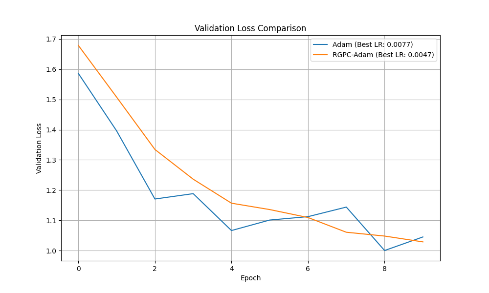

# Experiment: Relative Gradient Predictive Coding

## Hypothesis

The core idea is that the relationship between a parameter's value and its gradient is locally linear. If this holds, we can build a more intelligent momentum-like system. Instead of relying on a simple exponential moving average of past gradients, we can create a local predictive model for each parameter.

At each optimization step, this experiment proposes fitting a simple linear model (`gradient = a * weight + b`) to the recent history of a parameter's values and their corresponding gradients. This model can then predict the gradient for the *next* proposed parameter value. By averaging this prediction with the true gradient, we might achieve a more accurate and stable update step, potentially leading to faster convergence.

## Methodology

1.  **Optimizer Implementation**: A new PyTorch optimizer, `RelativeGradientPredictiveCoding`, was created. This optimizer wraps a base optimizer (in this case, `torch.optim.Adam`).
    *   It maintains a sliding window of the last `history_size` (set to 5) pairs of (parameter_value, gradient) for each parameter in the model.
    *   In its `step()` method, before calling the base optimizer's `step()`, it performs the following:
        *   If the history buffer is full, it fits a linear model to the history of each parameter element-wise using a regularized least-squares solver (`torch.linalg.solve`).
        *   It uses this model to predict the gradient at the current parameter value.
        *   The actual gradient (`p.grad`) is then updated to be the average of the true gradient and this predicted gradient.
    *   This modified gradient is then used by the base Adam optimizer for the final parameter update.

2.  **Comparison Setup**:
    *   **Dataset**: The `mnist1d` dataset was used for its rapid training characteristics.
    *   **Model**: A simple Multi-Layer Perceptron (MLP) with two hidden layers of 128 neurons and ReLU activation functions was used.
    *   **Fair Comparison**: To ensure a fair comparison between the standard `Adam` optimizer and our `RGPC-Adam` wrapper, `Optuna` was used to perform hyperparameter tuning. A study of 20 trials was conducted for each optimizer to find its optimal learning rate.
    *   **Evaluation**: Both optimizers were run for 10 epochs using their best-found learning rates, and their validation loss curves were recorded. To ensure reproducibility, the model's initial weights were identical for both optimizer trials.

## Results

The experiment was executed, and the learning rates for both optimizers were tuned.
*   **Best Adam LR**: 0.0077
*   **Best RGPC-Adam LR**: 0.0047

The best validation loss achieved by the standard Adam optimizer was **1.0005**, while the `RGPC-Adam` optimizer achieved a best validation loss of **1.0291**.

The validation loss curves for the best-performing trials of each optimizer are shown below:

## Conclusion

The results indicate that, for this specific task and model architecture, the **standard Adam optimizer slightly outperformed the Relative Gradient Predictive Coding approach**. The hypothesis that a local linear model of the gradient-parameter relationship could improve upon standard momentum was not supported by this experiment.

The overhead of the predictive coding step, combined with potential inaccuracies in the linear model, appears to provide no benefit over the well-established momentum mechanism of Adam. The final validation loss for RGPC-Adam was slightly higher, and its convergence curve appears less stable than the baseline.
