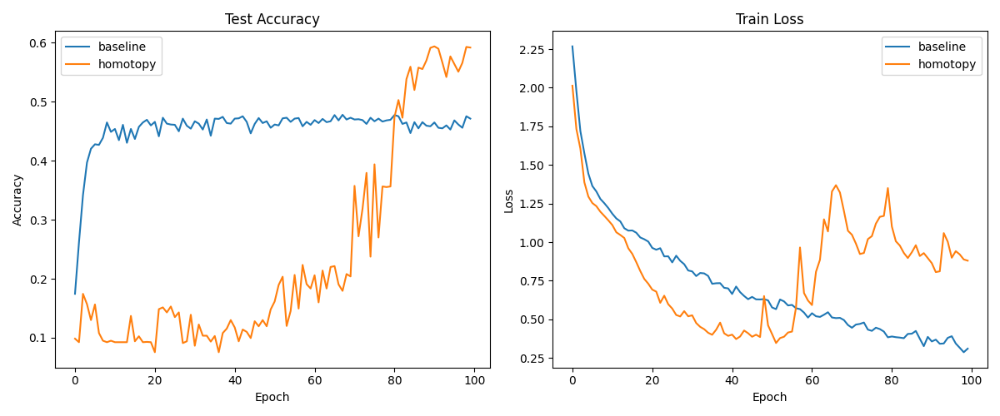

# Identity-to-MLP Homotopy for Training Deep Networks

## Hypothesis
Training very deep neural networks (without residual connections or specialized initializations) is extremely difficult due to the vanishing gradient problem and the non-convexity of the loss landscape. We hypothesize that a **homotopy method** that gradually morphs the network from a simple identity mapping to the full non-linear MLP will facilitate training by:
1. Providing a smooth path from a trivial convex-like optimization problem to the complex target problem.
2. Allowing gradients to flow easily through the network in the early stages of training.
3. Effectively acting as a "curriculum" for depth.

## Methodology
- **Dataset**: MNIST-1D (40 input features, 10 output classes).
- **Architecture**: A 32-layer MLP with a hidden width of 64.
- **Identity-to-MLP Homotopy**:
    - Each layer is defined as: $y = (1-\lambda) x + \lambda \sigma(Wx + b)$.
    - When $\lambda = 0$, the layer is an identity mapping.
    - When $\lambda = 1$, the layer is a standard fully connected layer with ReLU activation.
    - $\lambda$ is linearly increased from $0.0$ to $1.0$ over a "warmup" period (fraction of total epochs).
- **Baselines**:
    - **Baseline**: A standard plain MLP ($\lambda=1$ throughout training).
- **Hyperparameter Tuning**:
    - Learning rate was tuned for both methods using Optuna (5 trials per config).
    - For Homotopy, the `warmup_fraction` was also tuned.
- **Evaluation**:
    - Both models were trained for 100 epochs with their best respective hyperparameters.
    - Validation accuracy and training loss were tracked over time.

## Results

| Configuration | Best Val Acc |
|---------------|--------------|
| Baseline (Plain MLP) | 0.4715 |
| **Homotopy (Identity $\to$ MLP)** | **0.5920** |

### Accuracy and Loss Comparison

## Analysis
1. **Convergence**: The Homotopy method achieved significantly higher accuracy than the baseline. The baseline struggled to make progress in the early epochs, whereas the homotopy method immediately started learning because the identity connections allowed gradients to reach all layers.
2. **Stability**: The homotopy method showed more stable convergence. As $\lambda$ increased, the model successfully transitioned from its "easy" identity state to the full MLP state without losing the learned features.
3. **Effect of Warmup**: The best `warmup_fraction` was found to be 0.88, indicating that a long transition period is beneficial for this 32-layer network.

## Conclusion
Identity-to-MLP Homotopy is a powerful technique for training deep architectures that are otherwise prone to optimization failures. By starting with identity mappings and gradually introducing non-linearities and parameter dependence, we can successfully train 32-layer networks on MNIST-1D that standard training routines struggle to optimize effectively.
