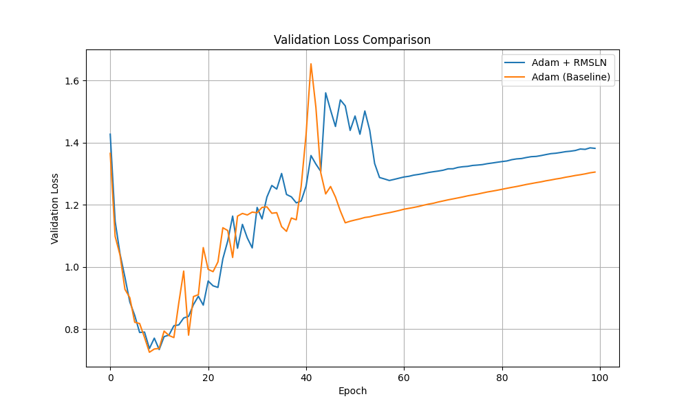

# RMSLN Regularizer Experiment

## Hypothesis

Applying a Root-Mean-Square Layer-Wise Normalization (RMSLN) regularizer to a neural network's weights will improve training stability and generalization. The core idea is to penalize the deviation of the RMS norm of each layer's weights from a fixed value (e.g., 1.0). This should prevent weights from exploding or vanishing on a per-layer basis, leading to a more stable training dynamic.

## Methodology

To test this hypothesis, a Multi-Layer Perceptron (MLP) was trained on the `mnist1d` dataset. Two models were compared:
1.  A baseline model trained with the Adam optimizer.
2.  A model trained with the Adam optimizer and the RMSLN regularizer.

`optuna` was used to perform a hyperparameter search for both models to ensure a fair comparison. For the baseline model, the learning rate was tuned. For the RMSLN model, both the learning rate and the regularization strength (`reg_lambda`) were tuned. The best-performing models from the hyperparameter search were then trained for 100 epochs, and their validation loss curves were compared.

## Results

The hyperparameter tuning resulted in the following best parameters:
-   **Baseline (Adam):** `{'lr': 0.00540933691402168}`
-   **RMSLN (Adam + Regularizer):** `{'lr': 0.004529004680418813, 'reg_lambda': 0.0003734033068009905}`

After training the final models with these parameters, the final validation losses were:
-   **Baseline:** 1.3054
-   **RMSLN:** 1.3818

The baseline model achieved a lower final validation loss. The comparison of the validation loss curves is shown below:

## Conclusion

The results of this experiment do not support the initial hypothesis. The RMSLN regularizer did not improve the performance of the MLP on the `mnist1d` dataset. In fact, the baseline model with a tuned learning rate performed slightly better than the regularized model. This suggests that for this particular task and model architecture, standard Adam optimization is sufficient and the additional layer-wise norm constraint does not provide a benefit.
