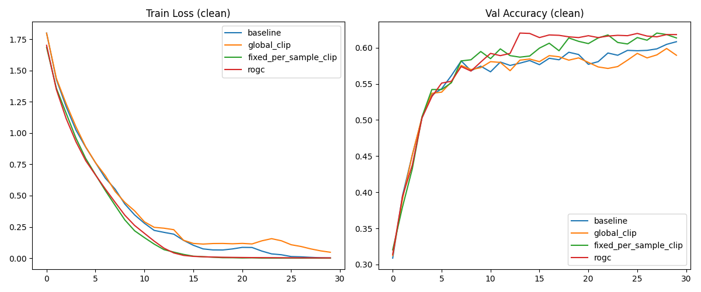

# Robust Outlier-based Gradient Clipping (ROGC) Experiment

This experiment investigates the effectiveness of per-sample gradient clipping using robust outlier detection (Tukey's fences) based on the Interquartile Range (IQR) of gradient norms within a batch.

## Hypothesis

Standard gradient descent is sensitive to outlier gradients, which can be caused by mislabeled samples or unrepresentative data points. By identifying and clipping these outliers at the per-sample level using the distribution of gradient norms in each batch, we can improve training stability and generalization, particularly in the presence of label noise.

## Methodology

### Clipping Strategies

1.  **Baseline**: Standard AdamW optimizer without any gradient clipping.
2.  **Global Norm Clipping**: Standard clipping applied to the norm of the batch-average gradient.
3.  **Fixed Per-Sample Clipping**: Individual sample gradients are clipped to a fixed, tuned threshold before being averaged.
4.  **ROGC (Proposed)**: Individual sample gradients are clipped to an adaptive threshold $\tau = Q3 + k \cdot IQR$, where $Q3$ is the 75th percentile of per-sample gradient norms in the batch, and $IQR$ is the interquartile range.

### Experimental Setup

-   **Dataset**: `mnist1d` (4,000 samples).
-   **Data Configurations**:
    -   **Clean**: Standard `mnist1d`.
    -   **Noisy**: `mnist1d` with 20% of training labels randomized.
-   **Model**: 3-layer MLP (256 hidden units).
-   **Tuning**: Learning rate and clipping parameters ($clip\_val$ or $k$) were tuned for each strategy using Optuna (20 trials) on both clean and noisy data.
-   **Evaluation**: Final evaluation over 3 random seeds (42, 43, 44) for 30 epochs.

## Results

### Performance Summary (Test Accuracy)

| Strategy | Clean Data | Noisy Data (20% Noise) |
| :--- | :--- | :--- |
| **Baseline** | 60.88% ± 1.04% | 46.67% ± 1.53% |
| **Global Norm Clipping** | 59.00% ± 0.94% | 47.17% ± 1.50% |
| **Fixed Per-Sample Clipping** | 60.88% ± 0.20% | **49.67% ± 1.13%** |
| **ROGC (Adaptive)** | 60.08% ± 0.93% | 49.46% ± **0.12%** |

### Key Observations

-   **Robustness to Noise**: Both per-sample clipping methods (Fixed and ROGC) significantly outperformed the Baseline and Global Norm Clipping on noisy data, improving accuracy by approximately 3%.
-   **Stability**: **ROGC demonstrated remarkable stability** on noisy data, with a standard deviation across seeds of only 0.12%, compared to 1.13% for Fixed Per-Sample Clipping and >1.5% for methods without per-sample clipping.
-   **Clean Data Performance**: On clean data, the Baseline and Fixed Per-Sample Clipping performed similarly. ROGC and Global Clipping showed slightly lower performance, suggesting that aggressive clipping might be slightly detrimental when the data is clean and gradients are reliable.

### Visualizations

#### Clean Data

#### Noisy Data (20% Noise)

## Conclusion

The hypothesis that robust, per-sample outlier-based gradient clipping improves training stability and performance under label noise was **strongly supported**. While fixed per-sample clipping achieved a slightly higher mean accuracy, ROGC provided much greater stability across seeds. This suggests that adaptively determining the clipping threshold based on the batch's own distribution is a robust way to handle noisy updates without manually tuning a fixed threshold for every dataset or noise level.

Per-sample clipping, in general, appears to be a much more effective defense against label noise than standard global norm clipping.
