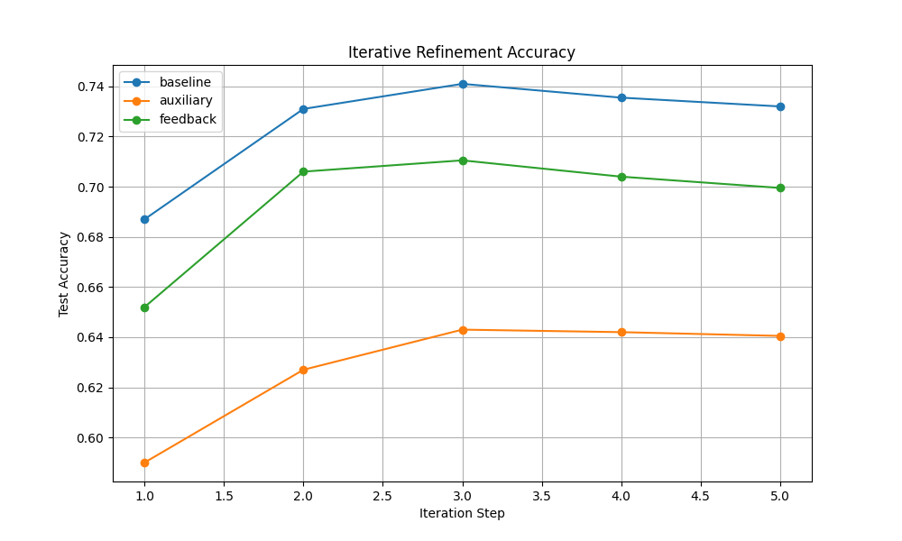

# Self-Assessed Iterative Refinement (SAIR)

## Hypothesis
Jointly training a model to refine its output iteratively and predict its own current loss provides a "metacognitive" signal that regularizes the hidden representation and improves final performance. Feeding back the predicted loss to the next refinement step may further help the model adjust its strategy based on its own estimated error.

## Methodology
- **Dataset:** `mnist1d` (10,000 samples, 10 classes).
- **Architecture:**
    - **Encoder:** Maps 40D input to 128D hidden state.
    - **Refiner:** A shared MLP block that updates the hidden state $h_t = h_{t-1} + R(h_{t-1}, x, \dots)$.
    - **Head:** Maps hidden state to 10D logits.
    - **Loss Predictor:** (For SAIR variants) Maps hidden state to a scalar representing the predicted CrossEntropy loss.
- **Variants:**
    1. **Baseline:** Iterative refinement with deep supervision (CE loss at each of 5 steps).
    2. **Auxiliary:** Baseline + auxiliary loss prediction task (MSE against detached CE loss).
    3. **Feedback:** Auxiliary + feeding back previous logits and predicted loss to the Refiner.
- **Tuning:** Learning rate and auxiliary loss weight ($\lambda$) were tuned using Optuna (10 trials per variant).
- **Evaluation:** Test accuracy across the 5 refinement steps.

## Results
Final test accuracies (after 20 epochs of training with best hyperparameters):

| Step | Baseline | Auxiliary | Feedback |
|------|----------|-----------|----------|
| 1    | 68.70%   | 59.00%    | 65.20%   |
| 2    | 73.10%   | 62.70%    | 70.60%   |
| 3    | 74.10%   | 64.30%    | 71.05%   |
| 4    | 73.55%   | 64.20%    | 70.40%   |
| 5    | 73.20%   | 64.05%    | 69.95%   |

## Findings
- **Baseline performance:** The baseline iterative model achieved the highest accuracy (74.1% at peak).
- **Auxiliary Task Interference:** Adding the loss prediction as an auxiliary task (without feedback) significantly degraded performance (max 64.3%). This suggests that for a model of this capacity on this task, the auxiliary objective competes with and distracts from the primary classification objective.
- **Value of Feedback:** The `Feedback` variant performed better than the `Auxiliary` variant (71.05% vs 64.3%), indicating that the model was able to extract some useful signal from its own previous predictions and estimated loss to improve subsequent refinement steps.
- **Stability:** All models showed a slight decline in accuracy in the final steps (steps 4 and 5), suggesting potential over-refinement or instability in the shared-weight recurrence.

## Conclusion
While the hypothesis that self-assessment would improve refinement was not supported in this specific setting (MNIST-1D with a small MLP), the experiment revealed that feeding back self-generated signals (logits and loss estimates) is significantly more effective than merely adding them as auxiliary training tasks. Future work could explore whether larger models or more complex tasks (where error patterns are more structured) benefit more from self-assessed feedback.
