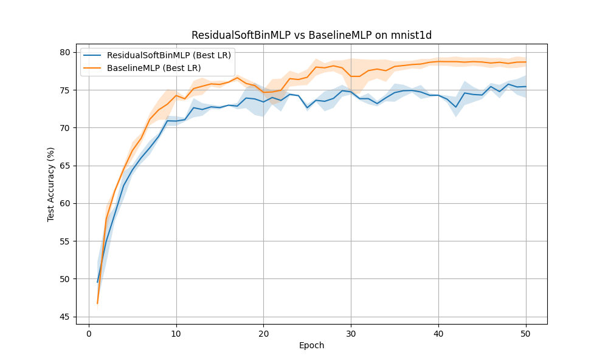

# Soft-Binning Feature Expansion for Tabular Data

## Hypothesis
Standard Multi-Layer Perceptrons (MLPs) often struggle to capture fine-grained non-linear relationships in tabular data because they rely on linear combinations of features followed by global activations. We hypothesize that expanding each input feature into a set of "soft-bin" assignments (using a differentiable softmax over distances to learnable centers) will provide a more expressive representation of the data, allowing the model to learn localized non-linearities more effectively. Specifically, we test a `ResidualSoftBinMLP` that concatenates the original features with their soft-bin assignments.

## Methodology
- **SoftBinningLayer**: Maps each feature $x_i$ to a $K$-dimensional vector of soft-bin assignments $s_{i,j} = \text{softmax}(-|x_i - c_{i,j}|^2 / \tau_i)$, where $c_{i,j}$ are learnable centers and $\tau_i$ is a learnable temperature.
- **ResidualSoftBinMLP**: Concatenates the original features with the output of a `SoftBinningLayer` (8 bins per feature) and processes the result through a 2-layer MLP (256 units per layer).
- **BaselineMLP**: A standard 2-layer MLP (512 -> 256 units) with a comparable number of parameters (~160k).
- **Dataset**: `mnist1d` (10,000 samples).
- **Hyperparameter Tuning**: Learning rates for both models were tuned using Optuna (8 trials each).
- **Evaluation**: The best configurations were evaluated over 3 random seeds for 50 epochs each.

## Results
The experiment showed that while the soft-binning expansion is a valid architectural addition, it was outperformed by the baseline MLP in this specific configuration on `mnist1d`.

| Model | Best Learning Rate | Test Accuracy (Mean +/- Std) |
| :--- | :--- | :--- |
| **Baseline MLP** | 0.00357 | **78.68% +/- 0.61%** |
| **ResidualSoftBinMLP** | 0.00659 | 75.43% +/- 1.49% |

### Analysis
- **Complexity and Overfitting**: The `ResidualSoftBinMLP` showed higher variance across seeds and lower mean accuracy. This suggests that the soft-binning expansion might be introducing too many parameters or unnecessary complexity that makes the optimization landscape more difficult or leads to overfitting on this dataset.
- **Inductive Bias**: `mnist1d` is a signal classification task where features are correlated in time/space. The soft-binning layer treats each feature independently, which might ignore the underlying structure more than a standard dense layer that can immediately learn correlations between raw features.
- **Potential for Improvement**: Different initializations for centers, fixed vs. learnable temperatures, or applying soft-binning only to specific features (e.g., those with high non-linearity) could potentially improve the performance.

## Visualizations
The test accuracy curves averaged over seeds are shown below:

## Verification
The mathematical logic, shape consistency, and gradient flow of the `SoftBinningLayer` were verified using unit tests in `test_logic.py`.

## Conclusion
Soft-binning feature expansion provides a differentiable way to perform non-linear feature transformation similar to binning or decision tree splits. However, on the `mnist1d` dataset, it did not outperform a standard MLP of similar parameter count. This highlights the importance of matching architectural inductive biases to the dataset characteristics.
