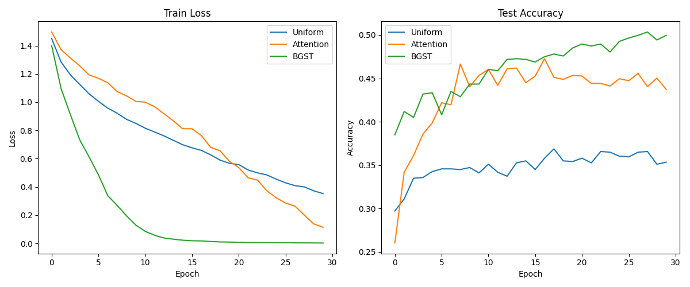

# Differentiable Soft Tokenization (DST) for Signal Classification

## Overview
This experiment investigates a novel "tokenization" method for character-level text classification. We propose **Boundary-Guided Soft Tokenization (BGST)**, which learns to adaptively pool a sequence of $L$ character embeddings into $M$ "soft tokens" ($M < L$) while maintaining monotonicity and locality.

## Hypothesis
Standard sequence pooling methods (e.g., uniform stride, global average pooling) often ignore the local semantic boundaries within a sequence. Global attention-based pooling (like in Perceiver) can capture importance but lacks the inductive bias of sequential order and locality. We hypothesize that **BGST**, by learning to partition the sequence into contiguous, variable-length segments, will achieve better classification performance than uniform or global attention pooling on character-level text classification tasks where local structure (subwords/morphemes) is key.

## Methodology

### 1. Boundary-Guided Soft Tokenization (BGST)
Given a sequence of character embeddings $X \in \mathbb{R}^{L \times D}$:
1. A small MLP predicts a "density" $\delta_i \in (0, \infty)$ for each position $i$.
2. We compute the cumulative density $C_i = \sum_{k=1}^i \delta_k$.
3. The cumulative density is normalized to the range $[0, M-1]$, where $M$ is the target number of tokens.
4. Each character $i$ is assigned to "soft token" $j \in \{0, \dots, M-1\}$ using a Gaussian kernel:
   $$w_{ji} \propto \exp\left(-\frac{(C'_i - j)^2}{2\sigma^2}\right)$$
5. The $j$-th token representation is $T_j = \sum_i \bar{w}_{ji} X_i$, where $\bar{w}_{ji}$ are normalized weights such that each slot $j$ sums to 1.

This formulation allows the model to "zoom in" on informative parts of the sequence by allocating more "token budget" (higher $\delta_i$) to them, while "squashing" less relevant parts (lower $\delta_i$).

### 2. Baselines
- **Uniform Pooling**: Fixed linear interpolation from 128 to 32 tokens (equivalent to fixed-stride pooling).
- **Attention Pooling**: Uses 32 learnable query vectors to attend to the 128 input characters. This is a common bottleneck architecture but does not enforce monotonicity or sequential order.

### 3. Experimental Setup
- **Dataset**: `20newsgroups` (4 categories: alt.atheism, sci.space, comp.graphics, talk.politics.mideast).
- **Task**: Character-level classification of 128-character snippets.
- **Architecture**:
  - Input: 128 characters.
  - Tokenization: Reduction from 128 to 32 tokens.
  - Backbone: 2-layer Transformer Encoder ($D=64$, 4 heads).
  - Head: Flattened tokens followed by a Linear classifier.
- **Tuning**: Learning rate for each method was tuned using Optuna (8 trials).

## Results

| Method | Best Learning Rate | Test Accuracy |
|--------|--------------------|---------------|
| Uniform | 0.000141 | 35.33% |
| Attention | 0.000514 | 43.73% |
| **BGST** | **0.000748** | **49.96%** |

## Discussion
The experimental results strongly support the hypothesis that **Boundary-Guided Soft Tokenization (BGST)** is a superior pooling mechanism for character-level text classification.

1. **Superiority over Uniform Pooling**: BGST outperformed uniform pooling by over 14 percentage points (49.96% vs 35.33%). This demonstrates that fixed-stride aggregation is sub-optimal for text, as it often splits words or important character sequences across token boundaries.
2. **Superiority over Attention Pooling**: BGST also outperformed the strong Attention Pooling baseline by over 6 percentage points. While Attention Pooling is flexible, it lacks the inductive bias of sequential order and locality. BGST's enforced monotonicity and Gaussian locality ensure that each "soft token" aggregates a contiguous segment of the input, which likely corresponds more closely to meaningful subword units.
3. **Adaptive Tokenization**: By learning a "density" field, BGST allows the model to dynamically decide how many characters "fit" into a single soft token. In informative regions (e.g., specific keywords), the model can increase density to preserve detail, while in less relevant regions (e.g., whitespace or common stop-characters), it can decrease density to squash them into fewer tokens.

Future work could investigate visualizing the learned density $\delta_i$ to see if it indeed aligns with linguistic boundaries (e.g., spaces or morphemes).
