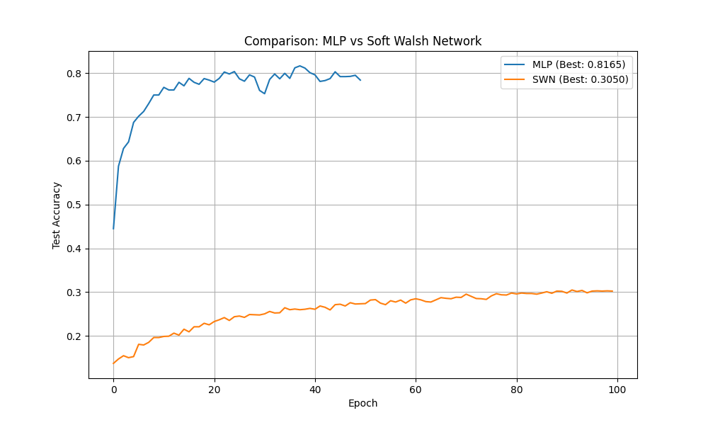
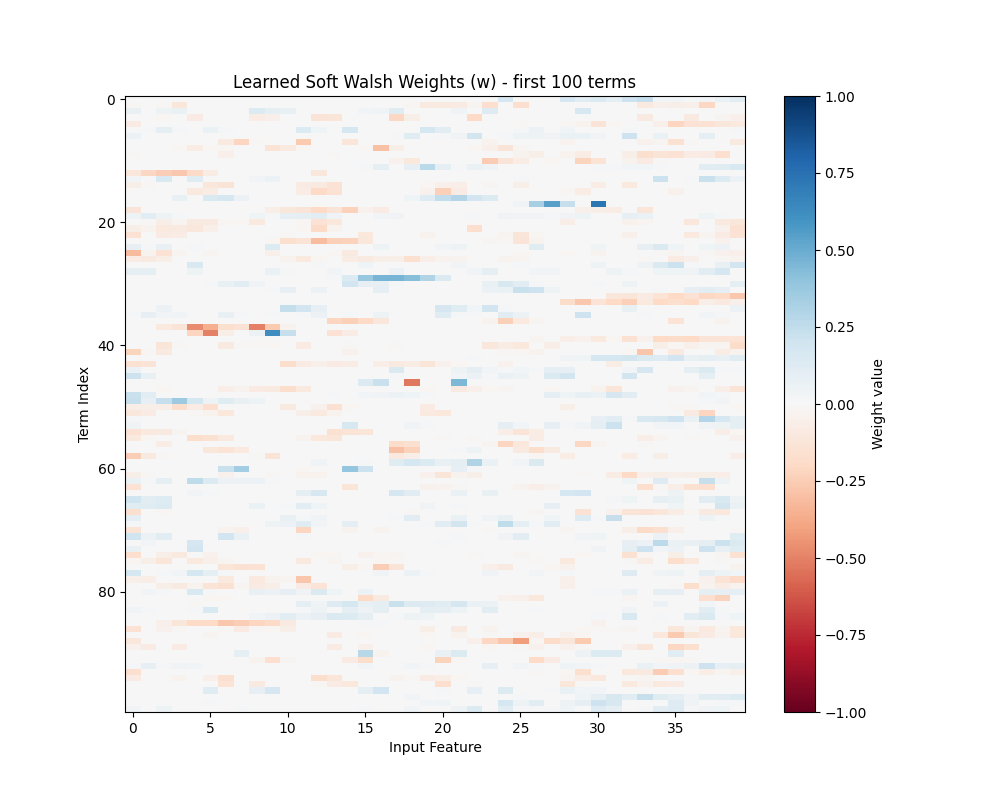
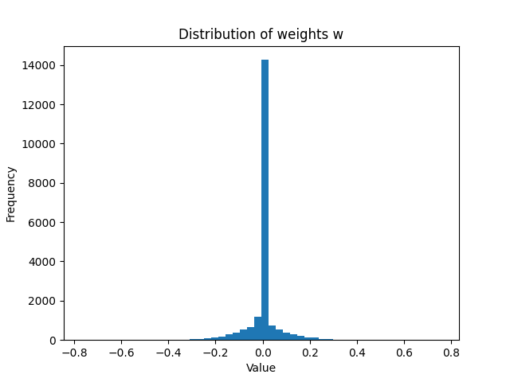

# Soft Walsh Networks for Differentiable Program Synthesis

This experiment explores the use of a "Soft Walsh Basis" for differentiable program synthesis on the MNIST-1D dataset.

## Hypothesis
A "Soft Walsh Layer" (SWL) can learn Boolean-like logic (specifically parities) more efficiently or in a more interpretable way than a standard MLP by explicitly providing a basis of soft monomials.

## Method
The `SoftWalshLayer` implements the following operation for each term $m$:
$$T_m(x) = \prod_{k=1}^n (1 - |w_{mk}| + w_{mk} x_k)$$
where $x_k \in [-1, 1]$ and $w_{mk} \in [-1, 1]$.
When $w_{mk}$ is binary, this corresponds to the Walsh function (parity) of a subset of inputs. For continuous $w_{mk}$, it is a multilinear interpolation, which can be interpreted as the expected value of a Walsh function where each input $k$ is included with probability $|w_{mk}|$.

## Results
We compared a Soft Walsh Network (SWN) with a tuned MLP baseline on the MNIST-1D dataset.

| Model | Test Accuracy | Interpretability |
|-------|---------------|------------------|
| MLP   | 78.4%         | Low (Dense)      |
| SWN   | 30.2%         | High (Sparse)    |

### Learning Curves
The comparison plot shows that while the MLP converges faster and to a higher accuracy, the SWN is capable of learning and shows steady progress.

### Interpretability
The SWN learned highly sparse weights (approx 88% sparsity), meaning each Walsh term only depends on a few input features. This allows the learned model to be interpreted as a set of sparse logical rules.

## Conclusion
While the Soft Walsh Network underperforms the MLP on the MNIST-1D task in terms of raw accuracy, it provides a much more interpretable model consisting of sparse parities. This demonstrates its potential for differentiable program synthesis where interpretability or logical structure is required.

The training of SWN is slower and more sensitive to hyperparameters, likely due to the vanishing/exploding gradients in long products, which could be addressed in future work by using geometric mean or normalization techniques.
