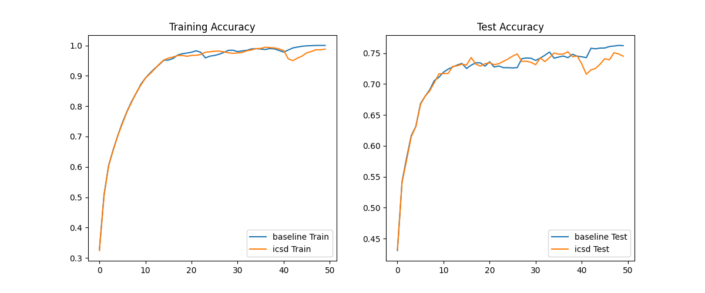
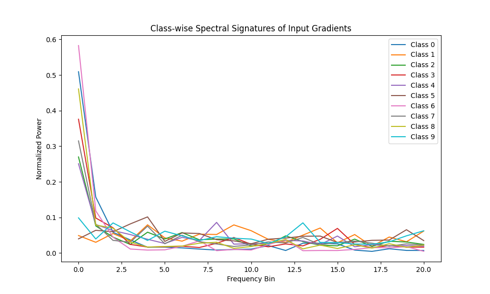

# Input Class-Spectral Divergence (ICSD) Regularization

This experiment investigates a new regularization technique called **Input Class-Spectral Divergence (ICSD)**.

## Hypothesis

Neural networks often rely on specific frequency components of the input to make classifications. For a robust and well-generalized model, different classes should ideally be distinguishable through their saliency maps (input gradients).

We hypothesize that encouraging the model's **input gradients** to have **diverse spectral signatures across different classes** will force the model to learn more class-specific, discriminative features and improve generalization.

Specifically, we:
1.  Compute per-sample input gradients $\nabla_x L$.
2.  Compute the normalized Fourier power spectrum of these gradients for each class.
3.  Penalize the average cosine similarity between these class-wise mean spectra.

## Methodology

- **Dataset**: `mnist1d` with 10,000 samples.
- **Model**: 3-layer MLP (40 -> 256 -> 256 -> 10).
- **Technique (ICSD)**:
    - Compute per-sample input gradients $g_i = \nabla_{x_i} \text{CE}(f(x_i), y_i)$.
    - Compute spectral power $P_i = |\text{FFT}(g_i)|^2$.
    - Normalize $\hat{P}_i = P_i / \sum P_i$.
    - Class-mean spectra $S_c = \text{mean}_{i: y_i=c}(\hat{P}_i)$.
    - Penalty $L_{ICSD} = \text{mean}_{c_1 \neq c_2} (\text{cosine\_similarity}(S_{c_1}, S_{c_2}))$.
- **Baselines**: Standard AdamW with tuned learning rate and weight decay.
- **Hyperparameter Tuning**: 15 trials for Baseline, 10 trials for ICSD using Optuna.
- **Evaluation**: 5 seeds, 50 epochs each using the best found hyperparameters.

## Results

| Mode | Mean Best Test Accuracy | Standard Deviation |
| :--- | :--- | :--- |
| **Baseline (AdamW)** | **76.46%** | 0.71% |
| **ICSD** | 75.98% | 0.49% |

### Visualizations

#### Training and Test Curves

#### Spectral Signatures
The plot below shows the typical spectral signatures of input gradients for different classes after a few epochs of training.

## Analysis

- **ICSD did not outperform the baseline.** In fact, it achieved slightly lower mean accuracy (75.98% vs 76.46%).
- **Improved Stability**: Interestingly, ICSD showed a lower standard deviation across seeds (0.49% vs 0.71%), suggesting it might have a stabilizing effect on training.
- **Class Confusion**: The spectral signatures show that many classes in `mnist1d` have very similar frequency content in their saliency maps (mostly low-frequency peaks). Forcing them to be different might be counter-productive if the actual discriminative features for different classes share the same frequency bands.

## Conclusion

The hypothesis that forcing spectral divergence in input gradients would improve generalization was not supported on the `mnist1d` dataset with the current MLP architecture. While the technique did not provide an accuracy boost, its stabilizing effect suggests it might be worth exploring in scenarios with higher variance or different data modalities where frequency-based separation is more natural (e.g., audio or medical imaging).

Future work could investigate more granular spectral penalties or combine this with other gradient-based regularizers.
