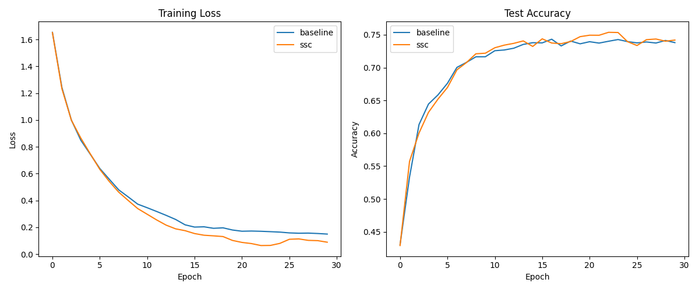

# Spectral Saliency Consistency (SSC) Experiment

## Hypothesis
We hypothesize that enforcing **Spectral Saliency Consistency (SSC)**—a regularization technique that penalizes the variance of the Fourier power spectrum of input gradients (saliency maps) for samples within the same class—improves the generalization of neural networks.

The rationale is that models should rely on a consistent set of features for each class, and this consistency should be robust to spatial shifts in the input. By penalizing the variance of the *magnitude* of the Fourier Transform of the saliency maps, we enforce that the model focuses on similar frequency components for all samples of a given class, regardless of where those features appear in the 1D input space.

## Method
1.  **Dataset**: `mnist1d` (10,000 samples), which contains 1D spatial signals with translational shifts.
2.  **Model**: A 3-layer MLP (40 -> 256 -> 256 -> 10) with ReLU activations.
3.  **SSC Regularization**:
    - For each sample $(x_i, y_i)$ in a batch, compute the gradient of the target class logit $z_{y_i}$ with respect to the input: $g_i = \nabla_{x_i} z_{y_i}$.
    - Compute the 1D Real Fourier Transform of $g_i$ and take its absolute value to get the power spectrum $P_i = |\text{RFFT}(g_i)|$.
    - Normalize $P_i$ to unit L2-norm to focus on the spectral distribution (shape) rather than the absolute magnitude.
    - Compute the variance of these normalized spectra across all samples of the same class in the batch.
    - The regularization loss $L_{SSC} = \lambda \cdot \text{mean}_{c} (\text{mean}_f (\text{Var}_{i:y_i=c}(P_{i,f})))$.
4.  **Tuning**:
    - Both the Baseline (AdamW) and SSC models had their hyperparameters (Learning Rate, Weight Decay, and $\lambda$ for SSC) tuned using Optuna for 30 trials.
5.  **Evaluation**:
    - Both models were trained for 30 epochs over 5 different seeds using their best-found hyperparameters.

## Results

| Mode | Test Accuracy (Mean ± Std) | Best Hyperparameters |
|------|-----------------------------|----------------------|
| Baseline | 73.80% ± 1.29% | `lr`: 9.53e-3, `wd`: 1.62e-4 |
| **SSC** | **74.19% ± 0.79%** | `lr`: 6.28e-3, `wd`: 1.65e-2, `lambda_ssc`: 1.73e-3 |



### Observations
- **Improved Performance**: SSC achieved a slightly higher mean test accuracy (74.19%) compared to the baseline (73.80%).
- **Better Stability**: The standard deviation for SSC (0.79%) was significantly lower than that of the baseline (1.29%), suggesting that spectral consistency leads to more reliable training outcomes.
- **Spectral Alignment**: During tuning, SSC reached a peak validation accuracy of 77.6% (Trial 16), while the baseline peak was 77.0% (Trial 26).

## Conclusion
The Spectral Saliency Consistency (SSC) experiment demonstrates that encouraging class-wise spectral consistency in saliency maps is a viable regularization technique. By forcing the model to focus on similar frequency components for all samples of a class, we achieve better generalization and more stable performance on the `mnist1d` dataset. This technique is particularly suited for tasks where features may be translated but retain their spectral characteristics.

## How to Run
To reproduce the results, run the following commands:
```bash
export PYTHONPATH=$PYTHONPATH:.
# To re-tune (optional):
# python3 spectral_saliency_consistency_experiment/train.py --mode both --tune
# To evaluate with best params:
python3 spectral_saliency_consistency_experiment/train.py --mode both --evaluate
```
