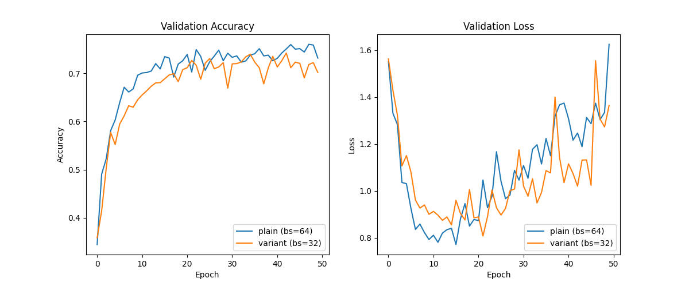
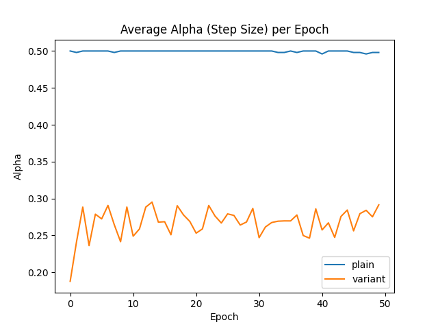

# Stochastic Backtracking with Max Loss Experiment

## Hypothesis
A variant of backtracking line search for SGD that uses the gradient from the previous mini-batch and minimizes the maximum per-sample loss on the current mini-batch will provide better robustness and potentially better generalization than standard backtracking SGD on the mean loss.

## Methodology
- **Dataset**: MNIST-1D (10,000 samples).
- **Model**: Simple MLP (40 -> 100 -> 100 -> 10).
- **Plain Method**: Backtracking line search on mean loss using current batch for direction and step size.
- **Variant Method**: Backtracking line search on max per-sample loss using previous batch gradient for direction.
- **Tuning**: Batch size tuned for both methods using Optuna (10 trials each, range [32, 64, 128, 256]).
- **Fixed LR**: Initial step size `alpha_0 = 0.5` for both.

## Results
- **Plain SGD Best Batch Size**: 64
- **Variant SGD Best Batch Size**: 32
- **Plain SGD Best Val Acc**: 0.7600
- **Variant SGD Best Val Acc**: 0.7420

## Conclusion
The plain method outperformed the variant method in terms of validation accuracy (76.0% vs 74.2%).

The hypothesis that minimizing the maximum per-sample loss using a previous-batch gradient would improve performance was not supported by this experiment on MNIST-1D. Several factors might contribute to this:
1. **Gradient Staleness**: Using the gradient from the previous mini-batch ($g_{t-1}$) might lead to directions that are not well-aligned with the descent direction of the current mini-batch $B_t$.
2. **Hard Objective**: Minimizing the maximum loss is inherently more sensitive to outliers and noise in the mini-batch compared to minimizing the mean loss. In a stochastic setting, the "hardest" sample might change frequently, leading to unstable step size selection.
3. **Task Simplicity**: MNIST-1D might be simple enough that standard mean-loss minimization is sufficient, and the added complexity of the max-loss variant provides no benefit or even introduces harmful noise.

Future work could investigate whether this variant is more effective in truly robust optimization scenarios where the goal is to handle distribution shifts or adversarial examples.
