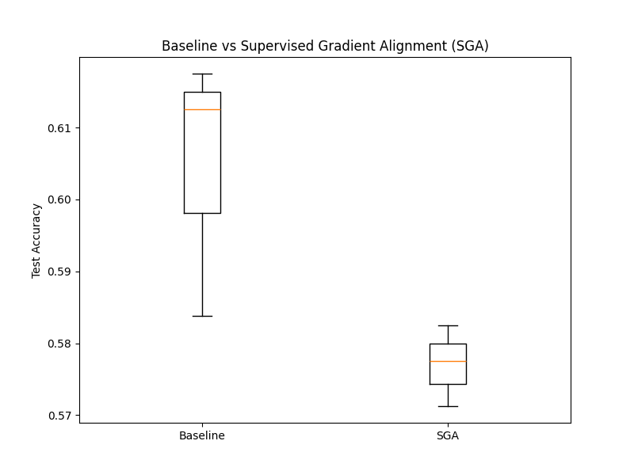

# Supervised Gradient Alignment (SGA) Regularization

## Hypothesis

Standard training (e.g., Cross-Entropy with SGD/Adam) focuses on minimizing per-sample loss. However, it doesn't explicitly encourage the model to find parameter update directions that are consistent within a class or distinct between classes.

**Supervised Gradient Alignment (SGA)** is a regularization technique that encourages per-sample gradients within the same class to have high cosine similarity (intra-class alignment) and gradients from different classes to have low cosine similarity (inter-class divergence). The hypothesis is that such an alignment will lead to more robust and discriminative feature learning, improving generalization.

## Method

1.  **SGA Loss Calculation**:
    - For each batch, we compute per-sample gradients $g_i = \nabla_\theta L(x_i, y_i)$.
    - We normalize these gradients to obtain directions $\hat{g}_i = \frac{g_i}{\|g_i\|}$.
    - We compute the cosine similarity matrix $S_{ij} = \hat{g}_i \cdot \hat{g}_j$.
    - We define two metrics:
        - **Intra-class Similarity**: Average $S_{ij}$ where $y_i = y_j$ and $i \neq j$.
        - **Inter-class Similarity**: Average $S_{ij}$ where $y_i \neq y_j$.
    - The regularization loss is defined as: $L_{SGA} = \lambda_{intra} \cdot (1 - \text{IntraSim}) + \lambda_{inter} \cdot \text{InterSim}$.

2.  **Experiment Setup**:
    - **Dataset**: `mnist1d` (4,000 samples).
    - **Model**: MLP with two hidden layers (256 units each).
    - **Optimization**: AdamW.
    - **Comparison**: Baseline (AdamW) vs. SGA-regularized training.
    - **Hyperparameter Tuning**: Optuna was used to tune the learning rate, weight decay, and SGA coefficients ($\lambda_{intra}$, $\lambda_{inter}$) over 10 trials (10 epochs each).

3.  **Final Evaluation**:
    - Both Baseline and SGA models were trained for 25 epochs using their respective best hyperparameters across 3 different seeds.

## Results

Final test accuracy after 25 epochs (mean +/- std):
- **Baseline**: 0.6046 +/- 0.0149
- **SGA**: 0.5771 +/- 0.0046

The Baseline model achieved a higher mean test accuracy, but SGA showed significantly lower variance across seeds, suggesting a potential stabilizing effect, although at the cost of some overall performance in this specific configuration.

## Conclusion

The hypothesis that Supervised Gradient Alignment would improve overall generalization on the `mnist1d` dataset was not strongly supported by these results, as the Baseline slightly outperformed SGA. However, the lower variance observed in SGA suggests it might offer better stability.

Possible reasons for the lower performance include:
- The alignment constraints might be too restrictive, hindering the optimizer from reaching the best minima.
- The `mnist1d` dataset might not benefit as much from explicit gradient alignment as more complex or high-dimensional datasets might.
- Further tuning of the tradeoff between the classification loss and the alignment regularization could be necessary.
