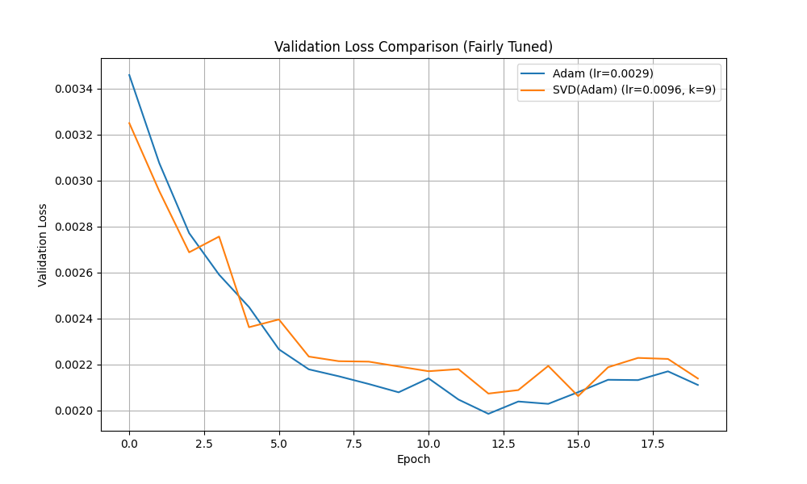

# SVD Gradient Optimizer Experiment

This experiment investigates the hypothesis that simplifying gradients via Singular Value Decomposition (SVD) can lead to more stable and effective training.

## Hypothesis

A significant portion of the gradient's complexity is noise. By decomposing the gradient with SVD and reconstructing it using only the top-k singular values, we can create a "denoised" gradient that improves training.

## Methodology

1.  **SVD Gradient Optimizer:** A PyTorch optimizer was created that wraps a base optimizer (Adam). In each step, it modifies the gradients of 2D weight tensors by:
    *   Performing SVD on the gradient matrix.
    *   Reconstructing the gradient using only the top `k` singular values.
    *   Passing this low-rank gradient approximation to the base Adam optimizer.

2.  **Fair Comparison:** To ensure a fair and scientifically valid comparison, two separate `optuna` studies (30 trials each) were conducted to find the optimal hyperparameters for each optimizer independently.
    *   For **Adam**, the `learning rate` was tuned.
    *   For **SVD(Adam)**, both the `learning rate` and the rank `k` were tuned.

3.  **Final Evaluation:** Both optimizers were trained for 20 epochs using their respective best-performing hyperparameters, and their validation loss curves were plotted.

## Results

After hyperparameter tuning, the best parameters were:
*   **Adam:** `lr=0.0029`
*   **SVD(Adam):** `lr=0.0096`, `k=9`

The validation loss comparison is shown below:

## Conclusion

After conducting a fair comparison with independent hyperparameter tuning, the results **do not support the initial hypothesis**.

The standard Adam optimizer consistently achieved a lower validation loss than the SVD(Adam) optimizer. While the idea of "denoising" the gradient is appealing, this experiment suggests that, for this task, the low-rank approximation removes valuable information from the gradient, hindering the learning process rather than helping it. The SVD-based method performed worse than a properly tuned Adam baseline.
