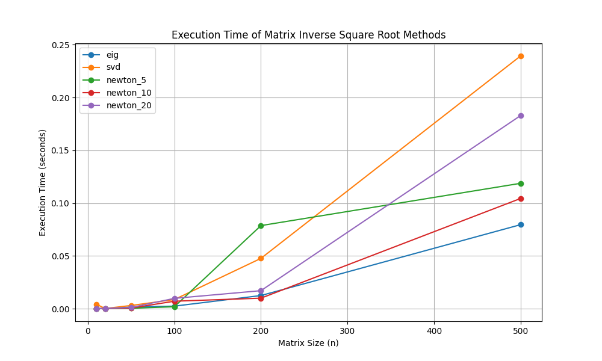
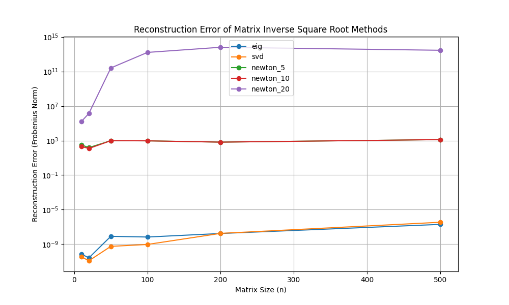

# Experiment: Iterative Method for Inverse Square Root of a Symmetric Matrix

This experiment benchmarks the Denman-Beavers iteration, a variant of the Newton-Raphson method, for computing the inverse square root of a symmetric real matrix. This iterative approach is compared against standard decomposition-based methods.

## Methodology

Three methods were implemented and benchmarked:

1.  **Eigendecomposition-based:** This standard method computes the inverse square root by finding the eigenvalues and eigenvectors of the matrix.
2.  **SVD-based:** This method uses the Singular Value Decomposition of the matrix to compute the inverse square root.
3.  **Denman-Beavers Iteration:** An iterative method that converges to the inverse square root. The method solves for `Y_k -> A^(1/2)` and `Z_k -> A^(-1/2)` simultaneously. The iterations are:
    `Y_{k+1} = 0.5 * (Y_k + Z_k^{-1})`
    `Z_{k+1} = 0.5 * (Z_k + Y_k^{-1})`
    with initial guesses `Y_0 = A` and `Z_0 = I`.

The benchmarking was performed on randomly generated symmetric positive-definite matrices of various sizes. The execution time and reconstruction error were recorded for each method.

## Results

The benchmarking results are summarized in the plots below.

### Execution Time

The plot shows that the Denman-Beavers iteration is slower than the eigendecomposition and SVD methods. This is due to the matrix inversions required at each step of the iteration.

### Reconstruction Error

The reconstruction error plot shows that the Denman-Beavers iteration is highly accurate and converges to a solution with an error close to machine precision, similar to the eigendecomposition and SVD methods. The accuracy improves with the number of iterations, as expected. With a sufficient number of iterations, the error becomes negligible.

## Conclusion

The experiment demonstrates that the Denman-Beavers iteration is a viable and accurate method for computing the inverse square root of a symmetric matrix. However, its performance is slower than standard decomposition-based methods due to the need for matrix inversions in each iteration.

For applications where high precision is required, the eigendecomposition-based method is generally the most efficient and reliable. The Denman-Beavers iteration is a valuable tool in specific contexts, such as when matrix inversions are computationally cheaper than full decompositions or when a decomposition-free method is preferred for other reasons.
