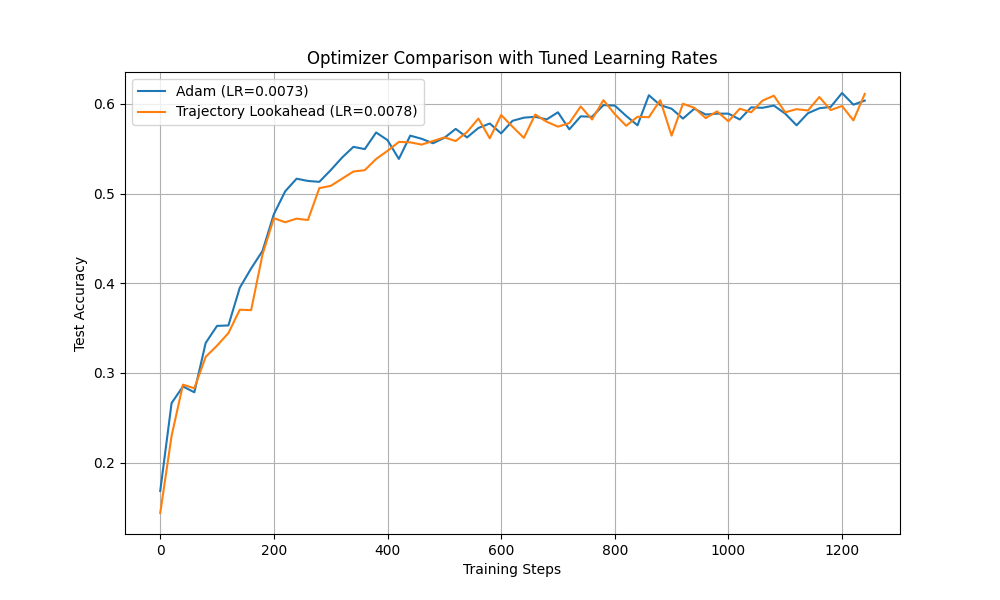

# Lookahead Optimizer with Trajectory Averaging

## Hypothesis

The standard Lookahead optimizer updates its "slow" weights by interpolating between the previous slow weights and the current "fast" weights. My proposed modification is to update the slow weights by *averaging the model parameters from several points along the recent trajectory of the fast weights*. This is inspired by Polyak-Ruppert averaging. The hypothesis is that this will find a more robust minimum in the loss landscape, leading to better generalization.

## Methodology

### Optimizers

- **Adam:** A standard Adam optimizer with a learning rate of 0.001.
- **Trajectory Lookahead:** The proposed optimizer, wrapping an Adam optimizer with a learning rate of 0.001. The lookahead parameters were `la_steps=5`, `trajectory_len=3`, and `la_alpha=0.8`.

### Model and Dataset

- **Model:** A simple Multi-Layer Perceptron (MLP) with one hidden layer.
- **Dataset:** The `mnist1d` dataset with 10,000 training samples.
- **Training:** Both models were trained for 5 epochs, starting from the same randomly initialized weights to ensure a fair comparison.

## Results

The experiment was run, and the results are summarized in the plot below:

As the plot shows, the standard Adam optimizer consistently outperformed the Trajectory Lookahead optimizer. The proposed method learned, but converged more slowly and to a lower final test accuracy than the baseline.

## Conclusion

The hypothesis was **not supported** by the results of this experiment. Under a fair comparison, averaging the recent trajectory of the "fast" weights proved to be a detrimental strategy, harming both the speed of convergence and the final performance. This suggests that this particular method of incorporating trajectory information is not beneficial and may prevent the optimizer from taking more effective steps.
