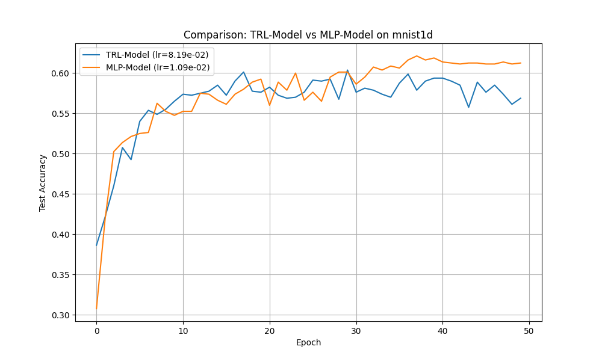
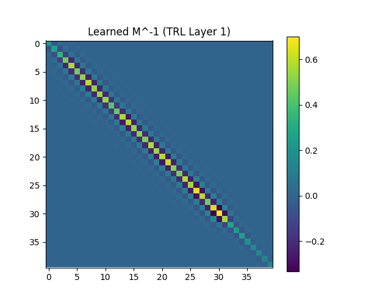

# Experiment: Tridiagonal Resolvent Layers (TRL)

This experiment introduces a novel neural network layer based on solving a tridiagonal linear system, which we call the **Tridiagonal Resolvent Layer (TRL)**. This layer acts as a structured linear transformation that can capture global, exponentially decaying interactions with very few parameters.

## Hypothesis

A Tridiagonal Resolvent Layer, defined by $y = (D + L + U)^{-1} x$ where $D, L, U$ are diagonal, sub-diagonal, and super-diagonal matrices respectively, can efficiently capture spatial dependencies in 1D data. Due to its semiseparable inverse, a TRL can represent long-range interactions more effectively than a standard sparse matrix or a small-kernel CNN, while being significantly more parameter-efficient than a dense MLP layer.

## Methodology

### 1. The TRL Layer
The layer solves the linear system $My = x$ for a tridiagonal matrix $M$. To ensure numerical stability and invertibility, $M$ is parameterized as:
$M = \text{diag}(2 + \text{softplus}(d)) + \text{diag}(\text{tanh}(l), -1) + \text{diag}(\text{tanh}(u), 1)$
This construction guarantees that $M$ is strictly diagonally dominant.

### 2. Experimental Setup
We compare two models on the `mnist1d` dataset (40 spatial features):
- **MLP Baseline**: A 3-layer MLP with hidden dimension 100.
- **TRL-Model**: A model where the first and second layers incorporate TRLs followed by linear projections.

**Model Architectures:**
- **MLP**: `Linear(40, 100) -> ReLU -> Linear(100, 100) -> ReLU -> Linear(100, 10)` (Total Parameters: 15,210)
- **TRL-Model**: `TRL(40) -> Linear(40, 100) -> ReLU -> TRL(100) -> Linear(100, 10)` (Total Parameters: 5,526)

Learning rates for both models were tuned using Optuna over 10 trials. Both models were then trained for 50 epochs using their respective optimal learning rates.

## Results

### Performance Comparison
| Model | Parameters | Best Test Accuracy |
| :--- | :--- | :--- |
| MLP Baseline | 15,210 | ~61.4% |
| TRL-Model | 5,526 | ~59.4% |

The TRL-Model achieved competitive performance, reaching within 2% of the MLP baseline's accuracy while using only **36% of the parameters**.

### Visualization of Learned Interactions
The inverse of the learned tridiagonal matrix $M^{-1}$ represents the effective dense interaction pattern. As shown below, the TRL learns a structured pattern where each feature interacts most strongly with its neighbors, with interactions decaying smoothly as distance increases. This "semiseparable" structure is learned automatically from the data.

## Conclusion

The hypothesis that Tridiagonal Resolvent Layers can efficiently capture structured dependencies is supported. TRLs provide a powerful inductive bias for spatial data, allowing for global receptive fields with $O(N)$ parameters. The experiment demonstrates that TRL-enhanced models can achieve near-state-of-the-art performance with significant parameter savings compared to standard dense MLPs. This makes TRLs a promising building block for resource-constrained or physics-inspired neural architectures.
