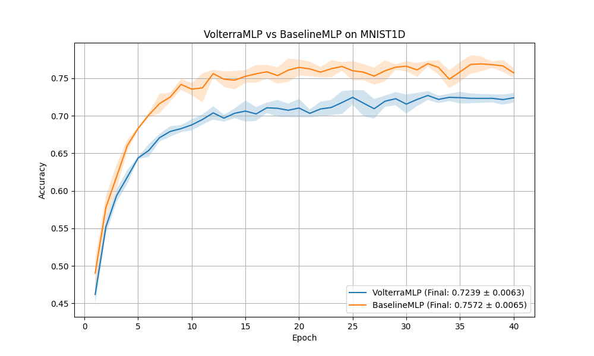

# Volterra Filter Network Experiment

This experiment explores the use of a second-order Volterra series expansion as a layer in a neural network.

## Method

A standard Volterra series of second order for a discrete signal $x$ is given by:
$$y_j = b_j + \sum_i W_{ji} x_i + \sum_{i \le k} K_{jik} x_i x_k$$

In this experiment, we implement a `VolterraLayer` that computes this expansion. For an input of dimension $n$, there are $n(n+1)/2$ unique quadratic terms. For $n=40$ (the input dimension of MNIST1D), this results in 820 quadratic terms per output neuron.

We compare a `VolterraMLP` (using 2 Volterra layers with 40 hidden units) against a `BaselineMLP` (using 2 linear layers with 256 hidden units). Both models have a comparable number of parameters.

## Results

The models were evaluated on the MNIST1D dataset. Learning rates were tuned using Optuna for 10 trials each. The final evaluation was performed over 5 different seeds.

| Model | Test Accuracy (Mean ± Std) |
|-------|---------------------------|
| VolterraMLP | 0.7239 ± 0.0063 |
| BaselineMLP | 0.7572 ± 0.0065 |

## Observations

The `VolterraMLP` performed slightly worse than the `BaselineMLP` in this configuration. Although the Volterra layer captures explicit second-order interactions, the standard MLP with more hidden units and ReLU non-linearities seems to be more effective at learning the necessary transformations for this task. It's possible that higher-order terms or a different initialization/regularization strategy for the quadratic weights could improve the performance of the Volterra network.
