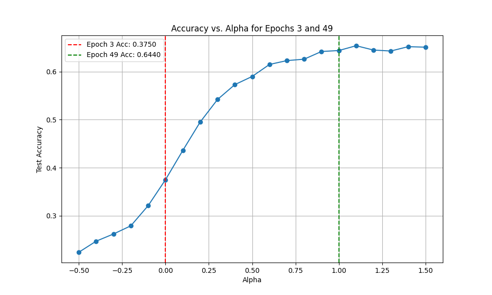

# Weight Interpolation Experiment

This experiment investigates whether interpolating the weights of a neural network from two different points in its training trajectory can lead to a model with better generalization performance.

## Hypothesis

A model created by linearly interpolating the weights of a neural network between two training snapshots (`W_interpolated = (1 - α) * W_epoch_i + α * W_epoch_j`) can achieve a lower test error than the final trained model. This suggests that the optimization path traverses regions where flatter, more generalizable minima exist *between* the points explicitly saved during training.

## Methodology

1.  **Training & Snapshots**: A simple Multi-Layer Perceptron (MLP) was trained on the `mnist1d` dataset for 50 epochs using the Adam optimizer. The complete `state_dict` of the model was saved at various epochs: `[0, 1, 2, 3, 4, 5, 10, 15, 20, 30, 40, 49]`. This process is handled by `main.py`.

2.  **Interpolation & Evaluation**: The `evaluate.py` script loads these snapshots and systematically evaluates the performance of interpolated models. It iterates through all unique pairs of saved epochs (`epoch_i`, `epoch_j`) and, for each pair, evaluates models created with 21 different interpolation coefficients (`alpha`) ranging from -0.5 to 1.5. This range allows us to test both interpolation (`0 < alpha < 1`) and extrapolation (`alpha < 0` or `alpha > 1`).

3.  **Comparison**: The accuracy of each interpolated model on the test set is calculated. The best-performing interpolated model is then compared against the baseline model, which is the model from the final training epoch (49).

## Results

The experiment successfully found an interpolated model that outperformed the baseline.

*   **Baseline Accuracy (Epoch 49)**: `0.6440`
*   **Best Interpolated Accuracy**: `0.6540`
*   **Improvement**: `+0.0100`

The best-performing model was achieved by interpolating between the weights of **epoch 3** and **epoch 49** with an **alpha of 1.10**. An alpha of 1.10 is a slight extrapolation, suggesting that moving a small step further from the epoch 3 model along the direction of the epoch 49 model leads to a better solution.

The plot below shows the accuracy landscape for this best pair of epochs as alpha varies.

As shown in the plot, the accuracy peaks outside the `[0, 1]` interval, confirming that extrapolation discovered a better minimum.

## Conclusion

The hypothesis was confirmed. Linearly interpolating (and extrapolating) between weight snapshots from a single training run can identify models with better generalization performance than the final model. This supports the idea that the direct optimization path is not always optimal, and that exploring the local geometry of the loss landscape, even in a simple linear way, can yield improvements.
