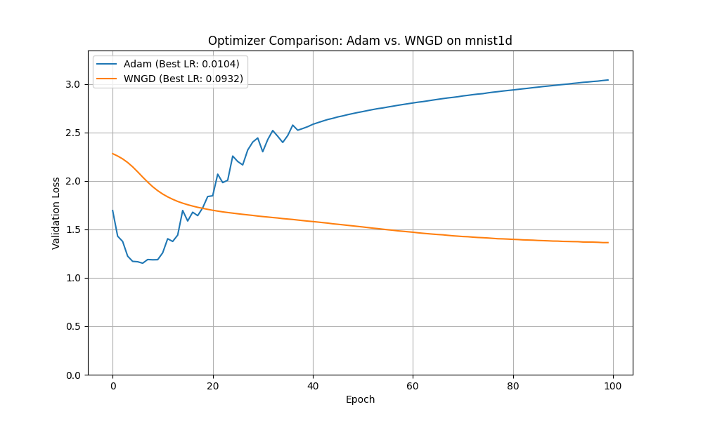

# Experiment: Weight-Norm-Normalized Gradient Descent (WNGD)

## Hypothesis
Normalizing the gradient of each weight by its L2 norm before the update step could lead to more stable training and improved generalization. This approach aims to make the optimizer less sensitive to the initial scale of the weights and the magnitude of the gradients, effectively creating a scale-invariant update rule. The hypothesis is that this WNGD optimizer might outperform a standard, well-tuned Adam optimizer.

## Methodology
To test this hypothesis, a new optimizer, `WNGD`, was implemented in PyTorch. The update rule for a weight `W` with gradient `G` is as follows:
`W_new = W_old - lr * (G / (||W_old|| + eps))`
where `||W_old||` is the L2 norm of the weight matrix.

A comparative study was conducted against the Adam optimizer on the `mnist1d` dataset. A simple Multi-Layer Perceptron (MLP) was used as the base model. To ensure a fair comparison, `optuna` was used to perform hyperparameter tuning for the learning rate of both optimizers over 15 trials. The best learning rates were then used to train the models for 100 epochs, and their validation loss curves were recorded.

## Results
The hyperparameter tuning yielded the following best learning rates:
- **Adam**: `0.0104`
- **WNGD**: `0.0932`

After training with these optimal learning rates, the final minimum validation losses were:
- **Adam**: `1.1505`
- **WNGD**: `1.3635`

The training performance is visualized in the plot below:

As the results show, the Adam optimizer achieved a significantly lower validation loss compared to the WNGD optimizer.

## Conclusion
The hypothesis that normalizing gradients by the weight norm would lead to better performance than Adam was not supported by this experiment. The WNGD optimizer, even with a tuned learning rate, converged to a higher validation loss. This suggests that while the idea of scale-invariant updates is appealing, this particular implementation may hinder the learning process, possibly by preventing weights from growing when necessary or by creating an update dynamic that is not as effective as Adam's momentum-based approach.
